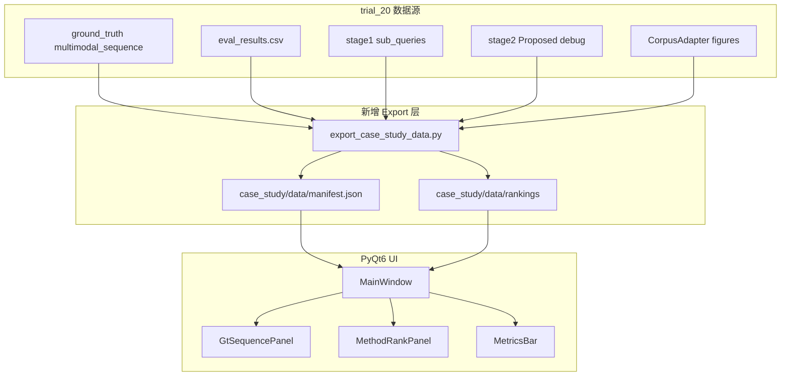

# Stage-2 Case Study UI 实现计划

## 目标与已确认决策

- **UI 形式**：PyQt6 桌面应用（与 [`data_annotation/main.py`](data_annotation/main.py) 一致，用 `QSplitter` 实现自适应左右分栏）
- **左栏**：[`data/trial_20/ground_truth/{paper_id}.json`](data/trial_20/ground_truth) 中的 `insertion_gt.multimodal_sequence`（正文 + 插入图 + 图注）
- **右栏**：各方法 Top-K 选图（默认 K=3，可调 5/10），Tab 切换 Proposed / 各 baseline
- **数据源**：默认读取最新 [`outputs/trial_20`](outputs/trial_20)

## 现有数据可用性（缺口分析）

| 数据 | 路径 | 是否足够 |
|------|------|----------|
| GT 多模态序列 | `data/trial_20/ground_truth/*.json` | 足够（左栏直接可用） |
| 逐方法指标 | `outputs/trial_20/eval/stage2_reranking_eval_results.csv` | 足够（顶栏） |
| Top-3 预测 | `outputs/trial_20/eval/stage2_reranking_diagnostics.jsonl` | 仅 K=3 |
| Proposed 详细 debug | `outputs/trial_20/stage2/{paper_id}.json` | 仅 top3 + 分数分解 |
| 图片路径/图注 | 经 `CorpusAdapter` + annotation minerU 路径 | 足够 |
| sub_queries | `outputs/trial_20/stage1/{paper_id}.json` | 可选展示 |
| **各方法完整/Top-K 排序** | **未落盘** | **需新增 export（K>3 必需）** |

当前 [`stage2_reranking_eval.py`](src/m3sum/eval/stage2_reranking_eval.py) 在内存中有完整 `ranked` 列表，但 diagnostics 只写入 `top3_predicted`。Case Study 需要 **Top-K 可配置**，因此必须增加排序结果导出。



## 目录结构（新建 `case_study/`）

```
case_study/
  config.yaml                 # 指向 trial_20 路径（可覆盖 output_dir）
  requirements.txt            # PyQt6 + PyYAML（复用项目已有依赖时可合并说明）
  README.md                   # 启动方式：先 export 再 python -m app.main
  scripts/
    export_case_study_data.py # 聚合 + 导出 Top-K 排序
  data/                       # export 产物（建议 .gitignore）
    manifest.json
    papers/{paper_id}.json
  app/
    main.py
    main_window.py
    data_loader.py
    widgets/
      metrics_bar.py          # 顶栏指标卡片
      gt_sequence_panel.py    # 左栏 GT 序列
      method_rank_panel.py    # 右栏 Tab + Top-K 列表
```

## 1. 数据导出层（先做，UI 依赖它）

### 1.1 新增导出脚本 [`case_study/scripts/export_case_study_data.py`](case_study/scripts/export_case_study_data.py)

- 读取 [`src/configs/trial_20.yaml`](src/configs/trial_20.yaml)（或 `case_study/config.yaml` 指定 config 路径）
- 复用现有 Python 栈：
  - `load_config` + `load_all_stage2_samples`
  - `_build_rankers()`（从 [`stage2_reranking_eval.py`](src/m3sum/eval/stage2_reranking_eval.py) 抽出可 import 的 helper，或在该模块新增 `build_stage2_rankers(config, skip_clip=False)` 避免复制）
- 对每篇 paper × 每个 method：
  - 调用 `ranker.rank(sample)` 得到完整 `RankedFigure[]`
  - 序列化前 **K_max=10**（满足 UI 的 K=3/5/10；可配置）
  - 每条记录：`rank, figure_id, score, caption, abs_image_path, is_ground_truth, in_top_k`
- 合并指标：从 CSV / diagnostics 读取 `r_precision, ip@3, ir@3, jaccard@3, map, mrr, maxsim@3`
- Proposed 额外字段：从 `stage2/{paper_id}.json` 的 `top3_figures[]` 按 `image_hash` join `s_direct/s_link/p_layout/cluster_prior` 等 debug（仅 top 项有）

### 1.2 每篇 paper 的 bundle 格式（`case_study/data/papers/{paper_id}.json`）

```json
{
  "paper_id": "...",
  "short_id": "2016_G_B022",
  "sub_queries": [...],
  "ground_truth_hashes": [...],
  "multimodal_sequence": [...],
  "methods": {
    "Proposed": {
      "metrics": {"jaccard@3": 0.5, "ip@3": 0.667, ...},
      "ranked_top10": [
        {"rank": 1, "figure_id": "...", "score": 0.69, "caption": "...", "image_path": "...", "is_gt": true, "debug": {...}}
      ]
    },
    "Qwen3-VL-Rerank-ImgCap": { ... }
  }
}
```

### 1.3 manifest（`case_study/data/manifest.json`）

- `trial_id`, `export_time`, `config_path`, `methods[]`, `papers[]`（short_id + paper_id + 关键指标摘要，供下拉列表排序/筛选）

### 1.4 可选：评估管线挂钩

在 [`run_stage2_reranking_eval`](src/m3sum/eval/stage2_reranking_eval.py) 末尾 **可选**调用 export（`if config.raw.get("case_study_export", False)`），避免每次 eval 后手动 export。默认关闭，Case Study 独立脚本为主入口。

**性能说明**：ranker 有缓存（VL-Rerank JSON、CLIP、text embed），export 主要是重放 rank 逻辑，预计 20 篇 × 7 方法可接受；VL API 已缓存时不重复计费。

## 2. PyQt6 UI 设计

### 2.1 主窗口布局 [`case_study/app/main_window.py`](case_study/app/main_window.py)

```
┌─────────────────────────────────────────────────────────────┐
│ Toolbar: [论文 ▼] [刷新数据] [K=3 ▼]                        │
│ MetricsBar: IP@3 | IR@3 | Jaccard@3 | MAP | MRR | MaxSim@3  │
├──────────────────────────┬──────────────────────────────────┤
│ GT 标注序列 (50%)        │ 方法选图 (50%)                   │
│ QScrollArea              │ QTabWidget: Proposed | baselines │
│ text / image blocks      │ QScrollArea: Top-K figure cards  │
└──────────────────────────┴──────────────────────────────────┘
         QSplitter (horizontal, stretch factors 1:1)
```

- **自适应**：`QSplitter` + `QScrollArea`；窗口 resize 时两栏同比伸缩；图片 `scaledContents` 限最大宽高
- **论文切换**：`QComboBox` 读取 manifest，显示 `short_id`，切换时加载对应 bundle

### 2.2 左栏 `GtSequencePanel`

- 遍历 `multimodal_sequence`：
  - `type=text` → 只读 `QTextEdit` / `QLabel`（word wrap）
  - `type=image` → 卡片：`QPixmap` 缩略图 + 图注 + **绿色「GT」角标**
- 图片路径解析：bundle 内写绝对路径；export 时通过 `FigureMeta.abs_image_path` 填充

### 2.3 右栏 `MethodRankPanel`

- `QTabWidget`：Tab 顺序与 [`stage2_reranking_viz.py`](src/m3sum/eval/stage2_reranking_viz.py) 的 `METHOD_ORDER` 一致
- 每个 Tab 内按当前 K 展示 `ranked_top10[:K]`：
  - **命中 GT**：绿色边框 + 「✓ GT」
  - **未命中**：灰色/红色边框
  - 显示 `rank`、`score`、caption 摘要、缩略图
- **Proposed Tab** 额外：点击/展开显示 `s_direct / s_link / p_layout / cluster_prior`（来自 stage2 debug join）
- K 切换：`QSpinBox` 或下拉 {3,5,10}，即时刷新右栏

### 2.4 顶栏 `MetricsBar`

- 展示当前 **论文 + 当前 Tab 方法** 的 metrics（来自 bundle，与 CSV 一致）
- 可选第二行：GT 数量、候选 figure 数、diagnostics `flags` 摘要（如 `high_maxsim_low_jaccard`）

### 2.5 启动方式

```bash
# 1. 导出（eval 完成后执行一次，rank 缓存命中时可秒级）
cd case_study
python scripts/export_case_study_data.py --config ../src/configs/trial_20.yaml

# 2. 打开 UI
python -m app.main
```

## 3. 配置 [`case_study/config.yaml`](case_study/config.yaml)

```yaml
trial_config: "../src/configs/trial_20.yaml"
data_dir: "./data"
export:
  max_rank: 10
  skip_clip: false   # 与 eval 一致以计算 maxsim 指标
ui:
  default_k: 3
  k_options: [3, 5, 10]
  default_method: "Proposed"
```

## 4. 验证计划

1. export 后检查：20 篇 paper bundle 齐全；每方法 `ranked_top10` 长度 ≤ 候选数
2. UI 抽检 3 篇（1 篇 Proposed 高分、1 篇 failure case、1 篇 GT 多图）：
   - 左栏 GT 序列与 [`ground_truth`](data/trial_20/ground_truth) 一致
   - 右栏 Top-3 与 `diagnostics.jsonl` 一致
   - K=5/10 能展示更深候选
3. 窗口缩放：1280×720 与 1920×1080 下 splitter 正常

## 5. 不在首版范围（可后续迭代）

- 多样本并排对比、导出 PNG 报告
- 在 UI 内触发 re-rank / 改 K 后重算指标
- Web/HTML 版 viewer

## 已确认（无需再问）

- UI：PyQt6
- 右栏：Top-K（3/5/10）
- 左栏：GT multimodal_sequence
