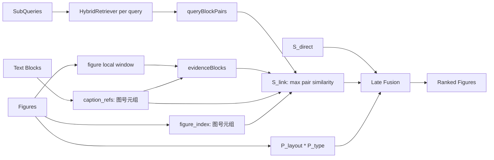

# LG-JSSF Stage-2 重构计划

## 目标

把 [`src/m3sum/stage2_rerank/`](src/m3sum/stage2_rerank/) 从当前的「图注正则命中 + 暴力共现累加」重构为 **LG-JSSF**：



---

## 已确认的关键决策

- `S_link` 不再使用合并去重后的 `cq_blocks`，而是保留每个子查询自己的召回结果：`(query_idx, block)` pair。
- `S_link(F_i)` 不再只依赖显式图号引用。每张图会先构建一个候选证据集合 `E_i`：
  - **显式引用证据**：正文 block 中 `caption_refs` 精确命中当前 `figure_index`，例如 `图5.1`、`图 5.1`。
  - **局部窗口证据**：该图在正文位置上下各一个 text chunk，用于覆盖“根据上图”“如下图所示”这类无编号引用。
- `S_link(F_i)` 在所有 `(query_block, evidence_block)` 组合上做 **max aggregation**，让显式引用块与图片邻近上下文 chunk “竞争上岗”，避免无条件窗口平均引入噪声。
- 图号内部表示使用 **整数元组**，例如：
  - `图 3` -> `(3,)`
  - `图2.1` -> `(2, 1)`
  - `图2.10` -> `(2, 10)`，不会被误判为 `(2, 1)`
  - `图02.1` -> `(2, 1)`
- 对外日志可显示为字符串/数字，但内部匹配不用 float，避免精度与格式歧义。
- 当前 pipeline 的正文中介召回并非单纯 BM25：`HybridRetriever` 已对赛题子查询召回 `C_Q` 使用 **BM25 + block embedding vector similarity** 的混合召回；但正文图号引用抽取本身是启发式规则，不是语义召回。`S_direct` 使用 query embedding 与 figure caption embedding，属于图注语义相似度。

---

## 当前代码问题定位

### 1. 引用解析过宽且不解析图号

[`src/m3sum/stage2_rerank/caption_regex.py`](src/m3sum/stage2_rerank/caption_regex.py) 当前只收集 `m.group(0)`：

```python
refs.extend(m.group(0) for m in pat.finditer(block.text))
```

[`src/m3sum/data/block_segmenter.py`](src/m3sum/data/block_segmenter.py) 也只返回字符串引用：

```python
caption_refs=_extract_caption_refs(sub)
```

### 2. Block schema 与目标不一致

[`src/m3sum/data/schema.py`](src/m3sum/data/schema.py) 当前为：

```python
caption_refs: list[str] = field(default_factory=list)
```

需要改为图号 token 列表（计划使用 `list[tuple[int, ...]]`）。

### 3. 共现分存在跨图噪声

[`src/m3sum/stage2_rerank/co_occurrence.py`](src/m3sum/stage2_rerank/co_occurrence.py) 当前是 `cq_blocks × cf_blocks` 双重循环累加：

```python
total += sim * w_cq * w_cf
```

这会让与当前图无硬绑定关系的 caption blocks 污染所有候选图。

### 4. 缺失“无编号邻近引用”的图片-正文连接

当前计划只覆盖 `如图5.1所示` 这类显式图号引用，但数学建模论文里还常见：

- “根据上图，……”
- “如下图所示，……”
- 图片正文附近直接解释图意，但正文不重复写图号

这些场景需要依赖图片物理位置上下文形成交互关系。因此每张图除显式引用块外，还应强制纳入图片所在位置上下各一个正文 chunk，作为候选 evidence，但最终打分必须使用 max 而不是平均，避免邻近窗口噪声拖累排序。

---

## 实施步骤

### 1. 新增图号解析工具

新增 [`src/m3sum/stage2_rerank/caption_refs.py`](src/m3sum/stage2_rerank/caption_refs.py)：

- `FigureRef = tuple[int, ...]`
- `parse_ref_number(text: str) -> FigureRef | None`
- `extract_caption_refs(text: str) -> list[FigureRef]`
- `figure_ref_to_str(ref: FigureRef) -> str`
- `parse_figure_index_from_caption(caption: str) -> FigureRef | None`

解析规则：

- 支持 `图3`、`图 3`、`见图2.1`、`如图 2.1 所示`、`表4`、`Figure 3`、`Table 2.1`
- 只抽取紧跟 `图/表/Figure/Table` 的编号
- 去掉每段数字的前导零
- 不把普通年份、公式编号、章节编号当作图号

### 2. 更新 schema 与分段逻辑

修改 [`src/m3sum/data/schema.py`](src/m3sum/data/schema.py)：

- `Block.caption_refs: list[tuple[int, ...]]`
- 可选增加 `FigureMeta.figure_index: tuple[int, ...] | None`，或不改 dataclass 而在 `reranker.py` 中实时解析。

修改 [`src/m3sum/data/block_segmenter.py`](src/m3sum/data/block_segmenter.py)：

- 复用 `extract_caption_refs()`
- text block 与 figure block 都写入结构化 `caption_refs`
- `has_caption_ref = bool(caption_refs)`

### 3. 重构 caption_regex.py 为兼容层

修改 [`src/m3sum/stage2_rerank/caption_regex.py`](src/m3sum/stage2_rerank/caption_regex.py)：

- 不再依赖配置里的宽泛 patterns 作为主逻辑
- `match_caption_blocks()` 只选择 `block.caption_refs` 非空的 text blocks
- `CaptionMatchResult.all_refs` 返回可读字符串，如 `图2.1`
- 保留函数名，避免破坏 `reranker.py` 之外的潜在调用

### 4. 构建每张图的 evidence blocks

新增或放入 [`src/m3sum/stage2_rerank/co_occurrence.py`](src/m3sum/stage2_rerank/co_occurrence.py) 的辅助逻辑：

- `FigureEvidenceBlock` dataclass：
  - `block`
  - `source`: `"explicit_ref" | "local_prev" | "local_next"`
  - `matched_ref: FigureRef | None`
- `collect_figure_evidence_blocks(figure, figure_index, blocks) -> list[FigureEvidenceBlock]`

候选 evidence 来源：

1. **显式图号引用块**：`block.block_type == "text"` 且 `figure_index in block.caption_refs`。
2. **图片上方邻近 chunk**：图所在 `figure.pos` 之前最近的一个 text block。
3. **图片下方邻近 chunk**：图所在 `figure.pos` 之后最近的一个 text block。

去重规则：

- 同一个 `block_id` 只保留一次。
- 显式引用优先级高于 local window；若同一 block 同时来自显式引用与邻近窗口，`source` 记录为 `explicit_ref`，debug 中可补充 `also_local=true`。

设计目的：

- 显式引用块覆盖 `如图5.1所示`。
- 上下文窗口覆盖 `根据上图` / `如下图所示`。
- 后续 `S_link` 用 max 选择最有用证据，而不是对所有窗口平均。

### 5. 替换 co_occurrence 为 S_link

修改 [`src/m3sum/stage2_rerank/co_occurrence.py`](src/m3sum/stage2_rerank/co_occurrence.py)：

新增：

- `QueryBlockPair` dataclass：`query_idx`, `block`, `query_embedding`
- `FigureEvidenceBlock` dataclass：`block`, `source`, `matched_ref`
- `link_score(...) -> tuple[float, dict]`

计算逻辑：

```python
for q_pair in query_block_pairs:
    q_block_emb = block_embeddings[q_pair.block.block_id]
    for evidence in evidence_blocks:
        e_emb = block_embeddings[evidence.block.block_id]
        sim = cosine_sim(q_block_emb, e_emb)
        w = distance_weight(block_distance(q_pair.block.block_idx, evidence.block.block_idx), distance_tiers)
        score = sim * w
        best = max(best, score)
```

返回 debug：

- matched query block id
- matched query idx
- matched evidence block id
- evidence source: `explicit_ref` / `local_prev` / `local_next`
- matched ref（如果是显式引用）
- raw cosine
- distance weight
- final link score

保留旧 `co_occurrence_score()` 可作为弃用 wrapper 或直接删除调用，但 `reranker.py` 不再使用它。

聚合策略：

- 对每张图，`S_link(F_i) = max_{q_pair, evidence in E_i}(cos(q_pair.block, evidence.block) * w_dist)`。
- 不使用平均值、不使用总和，避免无条件引入的上下窗口 chunk 成为噪声。
- 如果 `E_i` 为空或没有 embedding，则 `S_link(F_i)=0`。

说明：

- 赛题语义召回仍由 `HybridRetriever.search()` 产生 `query_block_pairs`，这是 BM25 + embedding vector 的混合召回。
- 图注/正文 evidence 的产生是启发式和物理位置驱动，不额外建立全局语义召回池。

### 6. 重构 reranker.py 的召回与晚融合

修改 [`src/m3sum/stage2_rerank/reranker.py`](src/m3sum/stage2_rerank/reranker.py)：

- `direct_similarity()` 可保持 max over query similarities。
- 召回阶段改为保留 query-block pair：

```python
query_block_pairs = []
for i, q in enumerate(sub_queries):
    for b in hybrid.search(q, blocks, block_embeddings, query_embeddings[i]):
        query_block_pairs.append(QueryBlockPair(i, b, query_embeddings[i]))
```

- 每张图解析 `figure_index`。
- 每张图调用 `collect_figure_evidence_blocks()` 得到 `evidence_blocks`。
- 新增先验：
  - `P_layout = 1 / log2(1 + index)`；无图号时回退 `body_order + 1` 或 `pos`，并记录 debug。
  - `P_type = 1.5 / 0.8 / 1.0`，按 caption 关键词判定。
- 最终公式：

```python
score = (alpha * s_direct + (1 - alpha) * s_link) * p_layout * p_type
```

- 输出字段建议扩展为：

```json
{
  "score": ...,
  "s_direct": ...,
  "s_link": ...,
  "p_layout": ...,
  "p_type": ...,
  "figure_index": "2.1",
  "evidence_blocks": [
    {"block_id": "b_12", "source": "explicit_ref", "matched_ref": "5.1"},
    {"block_id": "b_16", "source": "local_prev", "matched_ref": null}
  ],
  "debug": {...}
}
```

- 保留 `s_co` 字段一段时间可兼容旧评估/可视化，但值等于 `s_link` 或同时输出 `s_link`。建议首选新增 `s_link`，并保留 `s_co` 兼容旧 JSON 消费端。

### 7. 配置调整

修改 [`src/configs/trial_10.yaml`](src/configs/trial_10.yaml)：

- `rerank.alpha: 0.5`
- `caption_regex.patterns` 可保留但不作为主逻辑；如需清理，改成注释说明「当前由结构化解析器处理」。
- 运行验证时需要强制重跑 Stage-2，否则会读旧缓存：
  - 推荐命令中使用 `force_rerun: true` 临时设置，或执行 pipeline runner 时传 force。

### 8. 验证与输出

计划运行：

```powershell
cd c:\cursor_workspace\multimodal_summary_20260620\src
python scripts/run_pipeline.py configs/trial_10.yaml
python scripts/evaluate_stage2_reranking.py configs/trial_10.yaml
python scripts/plot_stage2_reranking.py configs/trial_10.yaml
```

如果 `run_pipeline.py` 未暴露 force 参数，则临时将 `configs/trial_10.yaml` 的 `run.force_rerun` 改为 `true` 后运行，再视需要恢复或保留。

最终检查文件：

- [`outputs/trial_10/stage2/`](outputs/trial_10/stage2/)：确认新字段 `s_link`, `p_layout`, `p_type`, `figure_index`
- [`outputs/trial_10/eval/stage2_reranking_eval_results.csv`](outputs/trial_10/eval/stage2_reranking_eval_results.csv)
- [`outputs/trial_10/eval/stage2_reranking_report.html`](outputs/trial_10/eval/stage2_reranking_report.html)

---

## 风险与处理

- **指标不一定突破 0.7**：算法会按要求实现，但 10 样本 GT、caption 质量和 Stage1 query 质量会影响上限；实现后会如实报告 R-Precision、MAP、MRR。
- **强先验可能过度偏向早期流程图**：`P_type=1.5` 与 `P_layout` 相乘可能压低后段关键结果图；先按指定公式实现，必要时下一轮可调权重。
- **图号缺失或图注格式异常**：回退到 `body_order + 1` 作为 layout index；仍可通过图片上下各一个 local window 参与 `S_link`，但不会参与显式引用匹配。
- **局部窗口引入噪声**：上下文 chunk 是无条件加入的候选 evidence，不参与平均，只通过 max aggregation 与显式引用块竞争，降低噪声影响。
- **显式引用与局部窗口重复**：同一 `block_id` 去重，显式引用优先，debug 保留来源信息，避免重复加分。
- **语义召回边界**：赛题侧 `C_Q` 继续使用 HybridRetriever 的 BM25 + vector 混合召回；图片 evidence 侧使用规则与物理位置，不单独做全局语义召回，避免扩大候选噪声。
- **缓存问题**：Stage-2 JSON 需要强制重跑，否则评估会继续读旧排序。

---

## 验收标准

实现完成后需要满足：

1. `Block.caption_refs` 存储结构化图号 token，能区分 `2.10` 与 `2.1`。
2. `caption_regex.py` 不再只返回宽泛字符串引用，而是基于结构化 `caption_refs` 找到显式引用 blocks。
3. 每张 figure 的 Stage-2 debug 中能看到：
   - `figure_index`
   - `evidence_blocks`
   - evidence 来源：`explicit_ref` / `local_prev` / `local_next`
   - `s_link` 命中的 query block 与 evidence block
4. `S_link` 使用 max aggregation，而不是 sum 或 mean。
5. 没有显式图号引用的图片，仍能通过上下文 local window 获得非零 `S_link`（前提是窗口 block 与赛题召回 block 相似）。
6. `reranker.py` 最终得分使用：

```python
score = (alpha * s_direct + (1 - alpha) * s_link) * p_layout * p_type
```

7. `trial_10.yaml` 的 `rerank.alpha` 更新为 `0.5`。
8. 强制重跑 Stage-2 后，`outputs/trial_10/stage2/*.json` 不再只包含旧 `s_co` 逻辑，而包含新字段 `s_link`, `p_layout`, `p_type`, `figure_index`, `evidence_blocks`。
9. 重新生成：
   - [`outputs/trial_10/eval/stage2_reranking_eval_results.csv`](outputs/trial_10/eval/stage2_reranking_eval_results.csv)
   - [`outputs/trial_10/eval/stage2_reranking_report.html`](outputs/trial_10/eval/stage2_reranking_report.html)
10. 报告中如实给出 Proposed 在 R-Precision、MAP、MRR 上是否突破 `0.7`；若未突破，需基于 debug 说明主要失败类型。

---

## 拟修改文件

- [`src/m3sum/stage2_rerank/caption_refs.py`](src/m3sum/stage2_rerank/caption_refs.py)（新增）
- [`src/m3sum/stage2_rerank/caption_regex.py`](src/m3sum/stage2_rerank/caption_regex.py)
- [`src/m3sum/data/schema.py`](src/m3sum/data/schema.py)
- [`src/m3sum/data/block_segmenter.py`](src/m3sum/data/block_segmenter.py)
- [`src/m3sum/stage2_rerank/co_occurrence.py`](src/m3sum/stage2_rerank/co_occurrence.py)
- [`src/m3sum/stage2_rerank/reranker.py`](src/m3sum/stage2_rerank/reranker.py)
- [`src/configs/trial_10.yaml`](src/configs/trial_10.yaml)

可选补充：若现有 baseline 或可视化读取 `caption_refs` 字符串，需同步适配相关 debug 展示逻辑。