# M3-Sum Pipeline 10 样本可行性试跑执行计划

## 0. 现状与约束

**已有资产（直接复用，不改动标注工具逻辑）：**

| 路径 | 用途 |
|------|------|
| [`data_annotation/`](c:\cursor_workspace\multimodal_summary_20260620\data_annotation) | `PaperLoader`、`ImageCandidate`、标注 JSON schema 1.0.0 |
| [`usable_data/cleaned_excellent_paper_mds/`](c:\cursor_workspace\multimodal_summary_20260620\usable_data\cleaned_excellent_paper_mds) | 39 篇论文 MD（摘要 + `##############` + 正文） |
| [`usable_data/problem_mds/`](c:\cursor_workspace\multimodal_summary_20260620\usable_data\problem_mds) | 9 篇赛题 MD（2016–2018 A/B/C/D） |
| [`data_annotation/annotations/*.json`](c:\cursor_workspace\multimodal_summary_20260620\data_annotation\annotations) | **11 篇**已完成 GT（insertions 1–5 张/篇） |

**缺口：** 无 `src/`、无文本块序列 `D`、无检索/生成/评测代码。

**用户确认：**
- API：**OpenAI 兼容**（`gpt-4o-mini` 文本、`text-embedding-3-small` 向量、`gpt-4o` 视觉）
- 检索 GT：**暂用 `insertions[].image_hash` 作为正例子集**（1–2 张为主），先跑通再扩展 2–8 张

---

## 1. 推荐目录结构（`src/` + 实验数据）

在仓库根目录新增，与现有 `data_annotation/` **并列**，通过 adapter 复用加载逻辑：

```
multimodal_summary_20260620/
├── data_annotation/          # 已有：标注工具（不动）
├── usable_data/              # 已有：语料（不动）
│
├── src/                      # 新建：M3-Sum 管线
│   ├── m3sum/
│   │   ├── __init__.py
│   │   ├── config.py                 # 读取 YAML + env（OPENAI_API_KEY）
│   │   │
│   │   ├── data/                     # 数据层
│   │   │   ├── schema.py             # TextBlock, FigureMeta, QueryBundle, RunArtifact
│   │   │   ├── corpus_adapter.py     # 包装 PaperLoader（sys.path → data_annotation）
│   │   │   ├── block_segmenter.py     # MD 正文 → D = {B_1..B_N}
│   │   │   ├── problem_resolver.py     # paper_id → problem_md（2016_G_A028 → 2016_A）
│   │   │   └── gt_loader.py            # 从 annotation JSON 提取 GT
│   │   │
│   │   ├── clients/                  # API 封装
│   │   │   ├── openai_llm.py           # 阶段一/三 LLM
│   │   │   ├── openai_embedder.py      # 向量检索
│   │   │   └── openai_vlm.py           # 阶段三图表描述
│   │   │
│   │   ├── stage1_query/
│   │   │   ├── query_builder.py
│   │   │   └── prompts/query_construction.txt
│   │   │
│   │   ├── stage2_rerank/
│   │   │   ├── hybrid_retriever.py     # BM25 + 向量 Top-P
│   │   │   ├── caption_regex.py        # 图注字面引用 → C_F
│   │   │   ├── layout_weights.py       # w_dist 离散权重
│   │   │   ├── co_occurrence.py        # S_co(F,Q)
│   │   │   └── reranker.py             # Score(F) = α·S_direct + (1-α)·S_co
│   │   │
│   │   ├── stage3_generation/
│   │   │   ├── vlm_describer.py
│   │   │   ├── adaptive_generator.py
│   │   │   └── prompts/generation.txt
│   │   │
│   │   ├── pipeline/
│   │   │   └── runner.py               # 分阶段 orchestrator + 断点续跑
│   │   │
│   │   └── eval/
│   │       ├── retrieval_metrics.py    # Hit@1/3, MRR
│   │       ├── insertion_metrics.py    # P/R/F1
│   │       ├── rouge_eval.py
│   │       └── report.py               # 汇总 CSV + Markdown
│   │
│   ├── scripts/
│   │   ├── prepare_trial_manifest.py   # 生成 trial_10 清单 + GT 索引
│   │   ├── run_pipeline.py             # CLI: --stage 1|2|3|all --sample ID
│   │   ├── sanity_check.py             # 各检验点自动化检查
│   │   └── run_eval.py
│   │
│   ├── configs/
│   │   └── trial_10.yaml               # 试跑超参 + 路径 + 10 样本列表
│   │
│   └── requirements.txt                # rank_bm25, openai, rouge-score, numpy, pyyaml
│
├── data/                     # 新建：试跑静态配置（非代码）
│   └── trial_10/
│       ├── manifest.json               # 10 样本 paper_id ↔ problem_key ↔ paths
│       └── ground_truth/
│           └── {paper_id}.json         # 从 annotation 自动生成的 GT 索引
│
└── outputs/                  # gitignore：运行产物
    └── trial_10/
        ├── stage1/{paper_id}.json
        ├── stage2/{paper_id}.json
        ├── stage3/{paper_id}.json
        ├── cache/embeddings/           # 块/图注向量缓存
        └── eval/report.json
```

**设计原则：**
- `data_annotation/` 保持 PyQt6 标注职责；`src/m3sum/data/corpus_adapter.py` 只读复用 [`PaperLoader`](c:\cursor_workspace\multimodal_summary_20260620\data_annotation\loaders\paper_loader.py)
- 所有中间结果落盘 JSON，支持 `--from-cache` 断点续跑，避免重复 API 调用
- `outputs/` 与 `data/` 分离：前者可变、后者为试跑定义

---

## 2. 数据准备与 Schema 设计

### 2.1 试跑 10 样本选取

从 11 篇已完成标注中选取 **10 篇**（年际均衡，insertions 数量有差异）：

| paper_id（缩写） | 年/题 | insertions |
|------------------|-------|------------|
| 2016_G_A028 | 2016 A | 2 |
| 2016_G_B022 | 2016 B | 3 |
| 2017_G_B104 | 2017 B | 3 |
| 2017_G_B154 | 2017 B | 3 |
| 2017_G_D035 | 2017 D | 1 |
| 2018_G_A229 | 2018 A | 1 |
| 2018_G_A466 | 2018 A | 1 |
| 2018_G_C008 | 2018 C | 3 |
| 2018_G_D029 | 2018 D | 2 |
| 2016_G_B294 | 2016 B | 3 |

排除：`2018_G_B203`（5 insertions，留作后续扩展集）。

### 2.2 赛题映射规则

[`problem_resolver.py`](src/m3sum/data/problem_resolver.py) 从 `paper_id` 解析 `{year}_G_{letter}*` → 匹配 [`usable_data/problem_mds/{year}_{letter}.*.md`](c:\cursor_workspace\multimodal_summary_20260620\usable_data\problem_mds)：

```
2016_G_A028.pdf-... → 2016_A.doc-fc19516d-....md
2017_G_B104.pdf-... → 2017_B.docx-dd76d7af-....md
```

### 2.3 文本块序列 D 与图表 F

**块切分**（[`block_segmenter.py`](src/m3sum/data/block_segmenter.py)）：

1. 取 MD 正文（`##############` 之后）
2. 按 `\n\n+` 切分为段落块；以 `# ` 开头的行强制新块（保留标题）
3. 遇到 `` 插入 `FigureBlock`，与相邻文本块共享/相邻 `block_idx`
4. 输出 `TextBlock`：`{block_id, text, char_start, char_end, has_caption_ref, caption_refs[]}`

**图表元数据 F**（扩展现有 [`ImageCandidate`](c:\cursor_workspace\multimodal_summary_20260620\data_annotation\models\paper.py)）：

```python
@dataclass
class FigureMeta:
    image_hash: str
    caption: str
    source_type: str          # image | table
    pos: int                  # block_idx，图在 MD 中的段落索引
    page_idx: int | None
    body_order: int
    abs_image_path: str
```

`pos(F)` = 该图 `` 所在 `FigureBlock` 的 `block_id`（与管线公式 $d = |pos(F) - pos(C)|$ 对齐）。

### 2.4 Ground Truth Schema（试跑版 v0.1）

[`data/trial_10/ground_truth/{paper_id}.json`](data/trial_10/ground_truth/) 由 `prepare_trial_manifest.py` 从标注 JSON 自动生成：

```json
{
  "schema_version": "0.1.0",
  "paper_id": "2016_G_A028.pdf-6e4c52f4-be1a-43fe-9a4f-f2f6fb479a0c",
  "sources": {
    "annotation_path": "data_annotation/annotations/2016_G_A028....json",
    "problem_md_path": "usable_data/problem_mds/2016_A.doc-....md"
  },
  "retrieval_gt": {
    "relevant_figure_hashes": ["29714b77...", "c666acc3..."],
    "note": "暂等于 insertions，后续可扩展为 2-8 张"
  },
  "insertion_gt": {
    "selected_hashes": ["29714b77...", "c666acc3..."],
    "reference_text": "<abstract.edited_text 纯文本>",
    "multimodal_sequence": "<annotation.multimodal_sequence>"
  }
}
```

**阶段二评测：** `retrieval_gt.relevant_figure_hashes`（当前 1–3 张/篇）  
**阶段三评测：** `insertion_gt.selected_hashes` + `reference_text`（ROUGE 参照）

### 2.5 各阶段输出 Schema

**Stage 1** — `outputs/trial_10/stage1/{paper_id}.json`：

```json
{
  "paper_id": "...",
  "problem_text": "...",
  "sub_queries": [
    {"dimension": "分析", "query": "...", "keywords": ["..."]},
    {"dimension": "建模", "query": "...", "keywords": ["..."]},
    {"dimension": "求解", "query": "...", "keywords": ["..."]}
  ]
}
```

**Stage 2** — `outputs/trial_10/stage2/{paper_id}.json`：

```json
{
  "paper_id": "...",
  "top3_figures": [
    {"rank": 1, "image_hash": "...", "score": 0.82, "s_direct": 0.9, "s_co": 0.71,
     "debug": {"matched_caption_blocks": 3, "top_cq_blocks": ["b_12", "b_45"]}}
  ],
  "all_scores": [...]
}
```

**Stage 3** — `outputs/trial_10/stage3/{paper_id}.json`：

```json
{
  "paper_id": "...",
  "figure_descriptions": [{"image_hash": "...", "description": "..."}],
  "generated_summary": "...",
  "inserted_figures": ["hash1"],
  "placeholders": ["[Insert Figure 29714b77]"]
}
```

---

## 3. 管道串联流程

```mermaid
flowchart TB
  subgraph prep [数据准备]
    M[manifest.json]
    PL[PaperLoader]
    BS[block_segmenter]
    PR[problem_resolver]
    GT[gt_loader]
  end

  subgraph s1 [阶段一 Query Construction]
    LLM1[gpt-4o-mini]
    Q3[3路 sub_queries]
  end

  subgraph s2 [阶段二 Layout-Aware Rerank]
    HR[HybridRetriever BM25+Embed]
    RX[caption_regex C_F]
    LW[layout_weights w_dist]
    CO[co_occurrence S_co]
    RR[reranker Score F]
    TOP3[Top-3 figures]
  end

  subgraph s3 [阶段三 Generation]
    VLM[gpt-4o vision]
    DESC[figure descriptions]
    LLM2[gpt-4o-mini]
    OUT[multimodal summary]
  end

  subgraph eval [评测]
    MET[Hit@K MRR ROUGE F1]
    RPT[report.json]
  end

  M --> PL --> BS
  PR --> s1
  BS --> s2
  GT --> eval
  LLM1 --> Q3 --> HR
  HR --> RR
  RX --> RR
  LW --> CO --> RR
  RR --> TOP3 --> VLM --> DESC --> LLM2 --> OUT
  TOP3 --> eval
  OUT --> eval --> RPT
```

### 3.1 伪代码执行序列

```python
# scripts/run_pipeline.py
for paper_id in manifest.samples:
    paper = corpus_adapter.load(paper_id)          # 复用 PaperLoader
    blocks = block_segmenter.segment(paper.body_text)
    figures = enrich_figures(paper.filtered_candidates, blocks)
    problem = problem_resolver.load(paper_id)

    # --- Stage 1 ---
    queries = query_builder.build(problem, llm=gpt4o_mini)
    save(stage1_path, queries)

    # --- Stage 2 ---
    for q in queries.sub_queries:
        C_Q += hybrid_retriever.search(q, blocks, top_p=20)
    C_F = caption_regex.match_blocks(blocks, figures)
    embed_cache.ensure(blocks, figures)            # 一次性 embed，落盘缓存

    scores = {}
    for F in figures:
        s_direct = max_sim(q.embedding, F.caption_emb)  # 3 query 取 max/mean
        s_co = co_occurrence(C_Q, C_F, F, blocks, w_dist_fn)
        scores[F.hash] = alpha * s_direct + (1-alpha) * s_co

    top3 = reranker.top_k(scores, k=3)
    save(stage2_path, top3)

    # --- Stage 3 ---
    descriptions = vlm_describer.describe(top3, gpt4o)
    result = adaptive_generator.generate(
        context=paper.abstract_text, queries, descriptions, llm=gpt4o_mini)
    save(stage3_path, result)

# --- Eval ---
run_eval(stage2_dir, stage3_dir, ground_truth_dir)
```

### 3.2 关键 API 调用逻辑

| 阶段 | 调用 | 模型 | 次数估算（10 样本） |
|------|------|------|---------------------|
| 1 | Chat Completions | `gpt-4o-mini` | 10 |
| 2 向量 | Embeddings | `text-embedding-3-small` | ~500 块 + ~200 图注（**缓存后仅 1 次**） |
| 3 视觉 | Chat + image | `gpt-4o` | ≤30（每篇 Top-3） |
| 3 生成 | Chat Completions | `gpt-4o-mini` | 10 |

**Stage 2 核心参数**（[`trial_10.yaml`](src/configs/trial_10.yaml)）：

```yaml
retrieval:
  top_p: 20
  bm25_weight: 0.4
  vector_weight: 0.6
rerank:
  alpha: 0.6          # S_direct 权重
  distance_tiers: [1.0, 0.7, 0.4]  # d<=1, 2-5, >5
caption_regex:
  patterns:
    - "见图\\s*[\\d\\.]+"
    - "如图\\s*[\\d\\.]+\\s*所示"
    - "图\\s*[\\d\\.]+"
    - "表\\s*[\\d\\.]+"
```

**Stage 1 Prompt 要点：** 输入赛题全文，要求 JSON 输出 3 个子查询（分析/建模/求解）+ 每路 keywords。  
**Stage 3 Prompt 要点：** 输入原摘要、3 子查询、Top-3 图表 VLM 描述；输出修订摘要 + 0–2 个 `[Insert Figure {hash_prefix}]` 或明确 `inserted_figures: []`。

---

## 4. 试跑检验点（Sanity Checkpoints）

每阶段完成后运行 [`scripts/sanity_check.py --stage N`](src/scripts/sanity_check.py)，**不通过则禁止进入下一阶段**。

| 检验点 | 时机 | 自动检查 | 人工 spot-check |
|--------|------|----------|-----------------|
| **CP0 语料加载** | 跑管线前 | 10 篇 MD/MinerU/content_list 均可加载；每篇 blocks≥20、figures≥3 | 打开 1 篇 MD，核对 block 切分 JSON |
| **CP1 赛题映射** | CP0 后 | 10/10 problem_md 非空；赛题含「问题1/2/3」或题号 | 核对 A028 ↔ 2016_A 系泊系统题 |
| **CP2 块-图位置** | CP0 后 | 所有 `insertion_gt` hash 的 `pos(F)` 非 -1；`pos` 分布 0..N-1 无全 0 | 打印 A028 的 fig→pos 对照表 |
| **CP3 子查询** | Stage 1 后 | JSON schema 合法；3 路 query 各≥10 字；keywords 非空 | **必读** 2 篇：子查询是否贴合赛题三问 |
| **CP4 图注正则** | Stage 2 召回后 | 每篇 `|C_F|≥1`；含「见图5.4.3」类 block 被命中 | 打印未命中样本的 caption_refs |
| **CP5 混合召回** | Stage 2 召回后 | 每篇 `|C_Q|≥5`；**GT hash 至少 1 张出现在 Top-P**（否则调 top_p/权重） | 查看 GT 在召回池中的排名 |
| **CP6 重排 Top-3** | Stage 2 完成后 | Top-3 无重复 hash；score 单调递减 | **必读** 3 篇：Top-1 是否为框架/核心图 |
| **CP7 VLM 描述** | Stage 3 视觉后 | 每条 description 20–200 字；不含「无法识别」 | 对照原图看 2 条描述 |
| **CP8 生成决策** | Stage 3 完成后 | `len(inserted)≤2`；placeholder 与 hash 一致 | 全文读 2 篇：插图为辅而非堆砌 |
| **CP9 评测** | eval 后 | 指标可复算；与 `report.json` 一致 | 填写 acceptance 表（见下） |

**Acceptance Rate 后验表**（低成本人工，10 篇 × 1 人）：

```
data/trial_10/acceptance_review.csv
paper_id, reviewer, accept(0/1), notes
```

---

## 5. 低成本快速评估方案

### 5.1 两档运行模式

| 模式 | 命令 | API 消耗 | 产出 |
|------|------|----------|------|
| **Dry-run（零 API）** | `--dry-run` | 0 | 仅 CP0–CP2 + 正则/BM25（本地） |
| **Retrieval-only** | `--stage 2` | Stage1 LLM + Embed 缓存 | Hit@1/3, MRR |
| **Full trial** | `--stage all` | 完整 | 全部指标 |

### 5.2 成本最小化策略

1. **Embedding 缓存：** 块文本 + 图注 embed 结果写入 `outputs/trial_10/cache/embeddings/{paper_id}.npz`，Stage 2/3 重跑不重复调用
2. **Stage 3 降级试跑：** 首次用 **caption 代替 VLM 描述**（`--vlm-mode caption`），仅验证 LLM 插入决策与 ROUGE；确认 Stage 2 稳定后再开 `gpt-4o` 视觉
3. **分阶段 gate：** Stage 2 的 Hit@3 均值 < 0.3 时不跑 Stage 3，先调 α / regex / top_p
4. **指标脚本本地计算：** Hit@K/MRR/ROUGE/P/R/F1 全部离线，无 API

### 5.3 评测实现

[`run_eval.py`](src/scripts/run_eval.py) 输出 [`outputs/trial_10/eval/report.json`](outputs/trial_10/eval/report.json)：

```json
{
  "retrieval": {"Hit@1": 0.4, "Hit@3": 0.7, "MRR": 0.55, "n": 10},
  "insertion": {"Precision": 0.6, "Recall": 0.75, "F1": 0.67},
  "generation": {"ROUGE-L": 0.42},
  "acceptance": {"rate": null, "pending_reviews": 10}
}
```

- **Hit@K / MRR：** pred = `stage2.top3_figures[:K].image_hash`，gold = `retrieval_gt.relevant_figure_hashes`
- **Insertion P/R/F1：** pred = `stage3.inserted_figures`，gold = `insertion_gt.selected_hashes`（空集合法）
- **ROUGE-L：** pred = `stage3.generated_summary`，ref = `insertion_gt.reference_text`（`rouge-score` 库）

**注意（试跑局限）：** 检索 GT 仅 1–3 张/篇，Hit@K 方差较大；报告需标注 `gt_mode: insertions_only`，后续扩展 GT 后复评。

---

## 6. 实施顺序（开发里程碑）

```mermaid
gantt
  title M3-Sum Trial 开发顺序
  dateFormat X
  axisFormat %s

  section DataLayer
  schema_block_segmenter     :0, 1
  corpus_adapter_gt          :1, 2

  section Stage2Local
  regex_bm25_embed           :2, 4
  reranker_sanity            :4, 5

  section APIStages
  stage1_openai              :5, 6
  stage3_gen_eval            :6, 8

  section Trial
  run10_eval_report          :8, 9
```



1. **M1 数据层：** `schema.py` + `block_segmenter.py` + `prepare_trial_manifest.py` → 通过 CP0–CP2
2. **M2 阶段二（本地为主）：** hybrid retriever + regex + reranker → 通过 CP4–CP6；出第一版 Hit@K
3. **M3 阶段一/三（OpenAI）：** LLM/VLM clients + prompts → 通过 CP3/CP7–CP8
4. **M4 评测与报告：** `run_eval.py` + acceptance CSV 模板 → CP9

**[`src/configs/trial_10.yaml`](src/configs/trial_10.yaml) 关键路径引用：**

```yaml
paths:
  annotation_config: "../data_annotation/config.yaml"  # 复用 mineru 根路径
  manifest: "../data/trial_10/manifest.json"
  output_dir: "../outputs/trial_10"

models:
  llm: "gpt-4o-mini"
  embed: "text-embedding-3-small"
  vlm: "gpt-4o"

trial:
  sample_ids: [ ... 10 paper_ids ... ]
  gt_mode: "insertions_only"
```

---

## 7. 风险与缓解

| 风险 | 缓解 |
|------|------|
| MinerU 外联路径在本机不可用 | 沿用 [`data_annotation/config.yaml`](c:\cursor_workspace\multimodal_summary_20260620\data_annotation\config.yaml) 的 `mineru_corpus_root`；CP0 先验 |
| 检索 GT 过少导致指标不稳定 | 试跑报告标注局限；Hit@K 同时报「GT 在 Top-P 召回率」 |
| 图注正则漏匹配（如「图5.4.3」无「见」） | CP4 人工补 pattern；记录 `caption_refs` 与 regex 差集 |
| API 成本超支 | 强制 embed 缓存 + `--vlm-mode caption` 首跑 |
| 块切分过碎/过粗影响 d | CP2 统计块长分布；必要时合并 <50 字相邻块 |
