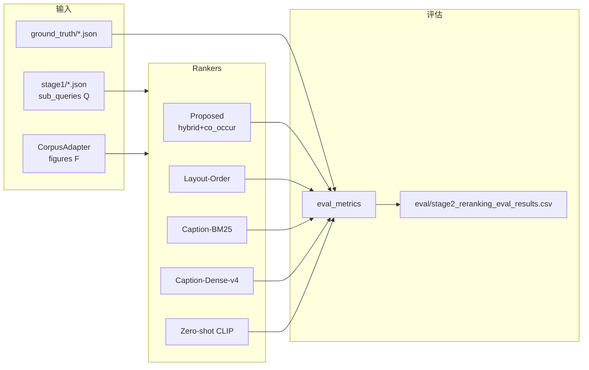

# Stage-2 图片重排序 Baselines 与评估指标实现计划

## 1. 项目结构总结

代码库采用三阶段 pipeline 架构，Stage-2 位于 [`src/m3sum/stage2_rerank/`](src/m3sum/stage2_rerank/)，评估位于 [`src/m3sum/eval/`](src/m3sum/eval/)，CLI 位于 [`src/scripts/`](src/scripts/)。



**现有 Stage-2 Proposed method** = [`reranker.rerank_figures()`](src/m3sum/stage2_rerank/reranker.py)（Hybrid BM25+向量召回 → 图注正则 → `alpha*s_direct + (1-alpha)*s_co`），由 [`PipelineRunner.run_stage2()`](src/m3sum/pipeline/runner.py) 编排并写入 `outputs/trial_10/stage2/{paper_id}.json`。

**现有评估**（[`eval/report.py`](src/m3sum/eval/report.py)）仅针对 Proposed 的 stage2 输出，指标为 Hit@1/Hit@3/MRR，且 MRR 只基于 `top3_figures`（非完整排序）。本次任务需**新增独立评估脚本**，不破坏现有 `run_eval.py` 行为。

---

## 2. 代码库检查问题回答

| # | 问题 | 结论 |
|---|------|------|
| 1 | 10 个 trial samples 在哪 | 清单：[`data/trial_10/manifest.json`](data/trial_10/manifest.json)；配置：[`src/configs/trial_10.yaml`](src/configs/trial_10.yaml) `trial.sample_ids`；GT：[`data/trial_10/ground_truth/{paper_id}.json`](data/trial_10/ground_truth/) |
| 2 | 每篇 paper 的 schema | 运行时 [`DocumentBundle`](src/m3sum/data/schema.py)；Stage1 输出含 `sub_queries`；Stage2 输出含 `top3_figures` + `all_scores`；GT 含 `retrieval_gt.relevant_figure_hashes` |
| 3 | figure 如何表示 | **无 `figure_id`**，统一用 **`image_hash`**（SHA256）；**无独立 `figure_number`**，编号嵌在 `caption`（如 `"图2 求解流程图"`）；路径为 `img_path`（相对）+ `abs_image_path`（绝对）；类型字段为 **`source_type`**（`"image"` / `"table"`），**无 flowchart 专用字段** |
| 4 | Stage-2 Proposed 在哪 | [`src/m3sum/stage2_rerank/reranker.py`](src/m3sum/stage2_rerank/reranker.py) + [`hybrid_retriever.py`](src/m3sum/stage2_rerank/hybrid_retriever.py) + [`co_occurrence.py`](src/m3sum/stage2_rerank/co_occurrence.py) |
| 5 | 评估如何调用 Proposed | 现有：读 stage2 JSON；本次新增：`ProposedRanker` adapter，**优先读 `all_scores` 缓存，缺失时 `PipelineRunner.run_stage2()` fallback**（用户确认） |
| 6 | embedding 封装 | 已有 [`OpenAIEmbedder`](src/m3sum/clients/openai_embedder.py)，配置键 `models.embed`（当前 `text-embedding-v4`）；[`EmbeddingCache`](src/m3sum/stage2_rerank/hybrid_retriever.py) 缓存 block/figure **文本** embedding（NPZ）；**query embedding 无缓存** |
| 7 | CLIP 工具 | **完全缺失**；需新建 Chinese-CLIP wrapper，默认模型 **`OFA-Sys/chinese-clip-vit-base-patch16`**（用户指定），解耦 `load_clip_model()` 便于后续替换 |
| 8 | 评估结果保存位置 | 现有 convention：`{output_dir}/eval/`（即 [`outputs/trial_10/eval/`](outputs/trial_10/eval/)）；新增 `stage2_reranking_eval_results.csv` 与同目录 `stage2_reranking_eval_results_zh.csv` |

---

## 3. 数据 Schema 与 ID 映射

**评估样本容器 `Stage2Sample`**（新建 dataclass）：

```python
@dataclass
class Stage2Sample:
    paper_id: str
    figures: list[FigureMeta]       # 候选集 F
    sub_queries: list[SubQuery]     # 查询集 Q（来自 stage1）
    ground_truth_ids: set[str]      # G = retrieval_gt.relevant_figure_hashes
```

**统一排序输出 `RankedFigure`**：

```python
@dataclass
class RankedFigure:
    figure_id: str      # = image_hash
    score: float
    rank: int           # 1-based
    method_name: str
```

**加载流程**（[`Stage2SampleLoader`](src/m3sum/stage2_rerank/sample_loader.py)）：
1. `CorpusAdapter.load_document(paper_id)` → figures
2. 读 `stage1/{paper_id}.json` → sub_queries（缺失则 skip + 日志）
3. 读 `ground_truth/{paper_id}.json` → G

**figure_number 解析**（新建 [`figure_number.py`](src/m3sum/stage2_rerank/figure_number.py)）：
- 正则：`图\s*(\d+(?:\.\d+)?)`、`表\s*(\d+...)`、`Figure\s*(\d+)`
- 解析失败 → fallback 到 `FigureMeta.body_order`（文档内原始顺序）
- Layout-Order baseline 按 `(parsed_number, body_order)` 升序；score = `-rank` 或 `1/rank`

---

## 4. Baseline 实现方案

所有 baseline 实现统一接口 `rank(sample: Stage2Sample) -> list[RankedFigure]`，放在 [`src/m3sum/stage2_rerank/baselines/`](src/m3sum/stage2_rerank/baselines/)。

### 4.1 Layout-Order（`layout_order.py`）
- 不依赖 Q
- 按 figure number 升序；无 number 则 `body_order`
- score = `-rank`（确定性）

### 4.2 Caption-BM25（`caption_bm25.py`）
- 复用 `rank_bm25.BM25Okapi`（已在 [`requirements.txt`](src/requirements.txt)）
- 抽取 [`hybrid_retriever._tokenize`](src/m3sum/stage2_rerank/hybrid_retriever.py) 到共享 [`tokenize.py`](src/m3sum/stage2_rerank/tokenize.py)（字符级，与现有 BM25 一致，保证确定性）
- 单篇 paper 内对 captions 建 index；`score(F_i) = mean_q BM25(q, caption_i)`
- 空 caption → 空 token 列表 → 得 0 分

### 4.3 Caption-Dense-v4（`caption_dense.py`）
- 复用 `OpenAIEmbedder` + `models.embed` 配置
- 新建 [`TextEmbeddingCache`](src/m3sum/stage2_rerank/text_embedding_cache.py)：`{output_dir}/cache/stage2_eval/text_embeddings/{paper_id}.npz`，缓存 query + caption vectors
- batch embed；`score = mean_q cosine(embed(q), embed(caption))`
- dry_run 模式：随机向量（与 pipeline 一致）

### 4.4 Zero-shot CLIP（`zeroshot_clip.py`）
- 新建 [`clip_utils.py`](src/m3sum/stage2_rerank/clip_utils.py)：
  - `load_clip_model(model_name: str) -> ChineseCLIPWrapper`（解耦，默认 `OFA-Sys/chinese-clip-vit-base-patch16`）
  - `encode_texts()` / `encode_images()` batch API
  - [`ClipImageEmbeddingCache`](src/m3sum/stage2_rerank/clip_utils.py)：`{output_dir}/cache/stage2_eval/clip_embeddings/{paper_id}.npz`
- `score = mean_q cosine(CLIP_text(q), CLIP_vision(image))`
- 缺失/损坏图片 → 0 分 + warning 日志
- 模型全局单例加载，评估脚本生命周期内复用

### 4.5 Proposed（`proposed.py`）
- **优先**：读 `stage2/{paper_id}.json` 的 `all_scores`（完整排序，非仅 top3）
- **Fallback**：调用 `PipelineRunner.run_stage2(paper_id)` 后再次读取
- 转换为 `RankedFigure(method_name="Proposed")`
- **不修改** `rerank_figures` 内部逻辑

---

## 5. 评估指标实现

新建 [`src/m3sum/eval/stage2_rerank_metrics.py`](src/m3sum/eval/stage2_rerank_metrics.py)，与 ranking 逻辑分离：

| 指标 | 函数 | 边界处理（对齐现有 [`retrieval_metrics.py`](src/m3sum/eval/retrieval_metrics.py) 习惯） |
|------|------|------|
| R-Precision | `r_precision(ranked_ids, gold, R=\|G\|)` | G 为空 → skip sample + 日志（不写行） |
| Jaccard@K | `jaccard_at_k(ranked_ids, gold, k=3)` | P∪G 为空 → 0.0 |
| MaxSim@K | `maxsim_at_k(ranked_ids, gold, clip_encoder, figures, k=3)` | P 或 G 为空 → 0.0；仅用 CLIP vision encoder |
| AP | `average_precision(ranked_ids, gold)` | G 为空 → skip；单 sample 的 `map` 列填 AP |
| MRR | 复用/扩展现有 `mrr()` | 基于**完整** ranked_ids；无命中 → 0.0 |

**诊断 case 检测**（评估主循环内）：
- CLIP 将 caption 含「流程图」的 figure 排在 top-5 之外
- MaxSim@3 > 0.5 且 Jaccard@3 < 0.3 → 标记「视觉相似但 ID 不匹配」
- Caption-BM25/Dense 分数高于 CLIP 且命中 GT → 标记「caption-heavy 优于 CLIP」

---

## 6. 评估主脚本与输出

### 6.1 核心模块
[`src/m3sum/eval/stage2_reranking_eval.py`](src/m3sum/eval/stage2_reranking_eval.py)：
- `run_stage2_reranking_eval(config) -> pd.DataFrame`
- 遍历 10 samples × 5 methods
- 中文 stdout 日志（paper_id、method、候选数、GT ids、top-3 pred、各指标）
- CLIP 方法额外输出 top-5 诊断块（query list、figure_id、caption snippet、score、source_type、是否命中 GT）
- 写入 JSON 诊断日志：`eval/stage2_reranking_diagnostics.jsonl`

### 6.2 CLI 入口
[`src/scripts/evaluate_stage2_reranking.py`](src/scripts/evaluate_stage2_reranking.py)

### 6.3 配置扩展
在 [`src/configs/trial_10.yaml`](src/configs/trial_10.yaml) 新增 `stage2_eval` 段（不硬编码路径）：

```yaml
stage2_eval:
  jaccard_k: 3
  maxsim_k: 3
  clip_model: "OFA-Sys/chinese-clip-vit-base-patch16"
  methods: ["Proposed", "Layout-Order", "Caption-BM25", "Caption-Dense-v4", "Zero-shot-CLIP"]
```

[`config.py`](src/m3sum/config.py) 增加对应字段读取（可选，缺省用默认值）。

### 6.4 输出文件

| 文件 | 内容 |
|------|------|
| `outputs/trial_10/eval/stage2_reranking_eval_results.csv` | 英文列名 DataFrame（50 行目标） |
| `outputs/trial_10/eval/stage2_reranking_eval_results_zh.csv` | 中文列名版本 |
| `outputs/trial_10/eval/stage2_reranking_diagnostics.jsonl` | CLIP 诊断 + 疑似 failure cases |

列：`paper_id, method_name, r_precision, jaccard@3, maxsim@3, map, mrr`

### 6.5 依赖新增
[`src/requirements.txt`](src/requirements.txt) 追加：
- `pandas>=2.0`
- `torch>=2.0`
- `transformers>=4.36`
- `Pillow>=10.0`

---

## 7. 拟新增 / 修改文件清单

**新增（约 15 个文件）**：

```
src/m3sum/stage2_rerank/
  sample_loader.py
  figure_number.py
  tokenize.py
  text_embedding_cache.py
  clip_utils.py
  baselines/
    __init__.py
    base.py
    layout_order.py
    caption_bm25.py
    caption_dense.py
    zeroshot_clip.py
    proposed.py
src/m3sum/eval/
  stage2_rerank_metrics.py
  stage2_reranking_eval.py
src/scripts/
  evaluate_stage2_reranking.py
```

**修改（最小化）**：
- [`src/configs/trial_10.yaml`](src/configs/trial_10.yaml) — 增加 `stage2_eval` 段
- [`src/m3sum/config.py`](src/m3sum/config.py) — 解析 `stage2_eval` 配置
- [`src/requirements.txt`](src/requirements.txt) — 新依赖

**明确不修改**：Stage-1、数据预处理、现有 `run_eval.py` / `report.py`、Proposed `rerank_figures` 核心算法。

---

## 8. 潜在风险与缺失信息

| 风险 | 缓解措施 |
|------|----------|
| Chinese-CLIP 首次运行需下载 ~400MB 模型 | 日志提示；`load_clip_model()` 解耦便于换本地路径 |
| `torch` 体积大，Windows CPU/GPU 环境差异 | 评估脚本支持 `--skip-clip` 跳过 CLIP baseline 与 MaxSim（开发调试用，默认全开） |
| 无 `figure_number` 字段，caption 格式多样 | regex + `body_order` fallback；日志记录解析失败 figure |
| 无 flowchart 类型标注 | 诊断时用 caption 关键词（「流程图」「示意图」）+ `source_type` 近似标记 |
| Caption-Dense 需 live API | dry_run 可冒烟；live 评估前确保 stage1 已缓存 |
| Proposed 依赖 stage2 缓存 | 评估前检查；缺失时 auto fallback `run_stage2`；日志明确说明来源 |
| 现有 MRR 只用 top3 | 新评估基于 `all_scores` 全排序，与旧 report 数字可能不同（预期行为） |
| GT 为空样本 | skip 并日志，不写入 CSV 行 |

---

## 9. 验收后运行命令

**前置条件**：stage1 输出已存在（Q）；建议 stage2 已跑完（Proposed 缓存）。

```powershell
cd c:\cursor_workspace\multimodal_summary_20260620\src

# 1. 安装新依赖
pip install -r requirements.txt

# 2. （可选）确保 Proposed stage2 缓存存在
python scripts/run_pipeline.py configs/trial_10.yaml

# 3. 运行 Stage-2 baselines + 扩展指标评估
python scripts/evaluate_stage2_reranking.py configs/trial_10.yaml
```

**预期输出**：
- stdout：每 sample × method 的中文指标日志 + CLIP 诊断
- `outputs/trial_10/eval/stage2_reranking_eval_results.csv`（目标 50 行）
- `outputs/trial_10/eval/stage2_reranking_diagnostics.jsonl`

**开发冒烟（零 API / 跳过 CLIP）**：
```powershell
python scripts/evaluate_stage2_reranking.py configs/smoke.yaml --skip-clip
```
