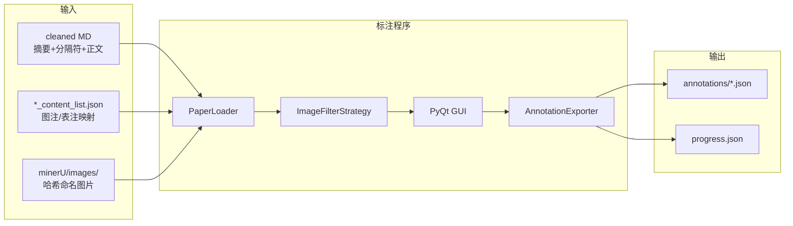

# 多模态摘要标注程序实现计划

## 1. 目标与约束

在 [`data_annotation/`](c:\cursor_workspace\multimodal_summary_20260620\data_annotation) 实现一个 **PyQt6 桌面标注工具**，用于标注：若将论文摘要扩展为多模态摘要，应在哪些位置插入正文中的哪些图片。

已确认决策：
- **GUI**：PyQt6/PySide6 原生拖拽
- **候选图范围**：仅 MD 正文（`##############` 之后）且 `content_list.json` 中 `img_caption` / `table_caption` 非空
- **工作流**：批量队列，自动遍历 [`usable_data/cleaned_excellent_paper_mds/`](c:\cursor_workspace\multimodal_summary_20260620\usable_data\cleaned_excellent_paper_mds)
- **撤销**：支持从左侧移除已插入图片，图片回到右侧候选池

## 2. 数据链路



### 2.1 外联规则（来自 [`数据外联规则.txt`](c:\cursor_workspace\multimodal_summary_20260620\usable_data\数据外联规则.txt)）

| 字段 | 规则 |
|------|------|
| `paper_id` | MD 文件名去扩展名，如 `2016_G_A433.pdf-ace5f580-0291-4b74-8e8a-3e24514c4563` |
| `mineru_dir` | `{mineru_corpus_root}/{paper_id}/` |
| `content_list` | mineru 目录下唯一 `*_content_list.json`（非 `layout.json`） |
| `image_path` | `{mineru_dir}/{img_path}`，如 `images/6c7afeee....jpg` |
| `image_hash` | 文件名去扩展名，与 MD 占位符 `` 一致 |

配置文件 [`data_annotation/config.yaml`](c:\cursor_workspace\multimodal_summary_20260620\data_annotation\config.yaml) 需包含可配置根路径：

```yaml
paths:
  md_corpus_root: "../usable_data/cleaned_excellent_paper_mds"
  mineru_corpus_root: "C:/Users/32780/Desktop/数模论文信息/minerU提取文件语料库/国赛"
  annotation_output_dir: "./annotations"
  progress_file: "./progress.json"

annotation:
  context_window_chars: 30        # 前后文窗口 N
  abstract_separator: "##############"

image_filter:
  strategy: "body_with_caption"   # 默认策略名
  # strategy_module: "filters.custom"  # 可选：自定义 Python 模块
  # strategy_class: "MyFilter"
```

## 3. 核心模块设计

建议目录结构：

```
data_annotation/
├── config.yaml
├── requirements.txt          # PyQt6, PyYAML
├── main.py                   # 入口
├── models/
│   ├── paper.py              # Paper, ImageCandidate, AnnotationResult
│   └── segments.py           # TextSegment, ImageSegment
├── loaders/
│   ├── md_loader.py          # 解析摘要/正文、提取正文图片 hash 集合
│   └── content_list_loader.py # 解析 content_list，构建 ImageCandidate
├── filters/
│   ├── base.py               # ImageFilterStrategy 抽象基类
│   ├── registry.py           # 策略注册表
│   └── body_with_caption.py    # 默认策略
├── export/
│   └── annotation_exporter.py
├── storage/
│   └── progress_tracker.py   # 队列进度、跳过/完成状态
└── ui/
    ├── main_window.py
    ├── abstract_editor.py    # 左侧图文混排编辑器
    ├── image_pool_panel.py   # 右侧候选图面板
    └── widgets/
        ├── draggable_image_card.py
        └── inserted_image_block.py
```

### 3.1 PaperLoader 加载逻辑

对队列中每篇 `paper_id`：

1. **读 MD**：按 `abstract_separator`  split，前半为 `abstract_text`，后半为 `body_text`
2. **读 content_list**：glob `*_content_list.json`，遍历 `type in ("image", "table")` 且含 `img_path` 的条目
3. **构建 ImageCandidate 列表**（原始全集，供策略过滤）：

```python
@dataclass
class ImageCandidate:
    image_hash: str           # "6c7afeee6db07ee729fab9b3f386cf98ab3898d1f958fe1155ab9d3405796e01"
    image_filename: str       # "{hash}.jpg"
    img_path: str             # "images/{hash}.jpg"
    abs_image_path: str       # 绝对路径，供 UI 加载
    source_type: str          # "image" | "table"
    caption: str              # img_caption[0] 或 table_caption[0]（合并多行用空格）
    captions_raw: list[str]
    page_idx: int | None
    body_order: int           # 在 content_list 中出现顺序（正文过滤后重编号）
    in_body_md: bool          # hash 是否出现在 body_text 的  中
```

4. **caption 提取规则**：
   - `type=="image"` → `img_caption`
   - `type=="table"` → `table_caption`
   - 非空判定：`any(s.strip() for s in captions)`

5. **正文 hash 集合**（正则）：

```python
BODY_IMG_RE = re.compile(r'!\[\]\(images/([a-f0-9]+)\.(jpg|png|jpeg)\)', re.I)
```

6. **错误处理**：mineru 目录或 content_list 缺失 → 标记为 `skipped`，写入 progress，队列跳至下一篇

### 3.2 图片筛选策略（解耦）

[`filters/base.py`](c:\cursor_workspace\multimodal_summary_20260620\data_annotation\filters\base.py)：

```python
class ImageFilterStrategy(ABC):
    name: str
    @abstractmethod
    def filter(self, candidates: list[ImageCandidate], paper: Paper) -> list[ImageCandidate]: ...
```

[`filters/body_with_caption.py`](c:\cursor_workspace\multimodal_summary_20260620\data_annotation\filters\body_with_caption.py)（默认）：

```python
def filter(candidates, paper):
    return [c for c in candidates
            if c.in_body_md and c.caption.strip()]
```

[`filters/registry.py`](c:\cursor_workspace\multimodal_summary_20260620\data_annotation\filters\registry.py) 按 `config.image_filter.strategy` 名称实例化；若配置了 `strategy_module` + `strategy_class`，则动态 import 自定义策略。

**预留策略**（后续可扩展，首版仅实现默认）：
- `all_body_images`：正文全部图片，不要求 caption
- `all_with_caption`：全文有 caption 即可

## 4. UI 设计与交互逻辑

### 4.1 主窗口布局

```
┌─────────────────────────────────────────────────────────────┐
│ [上一篇] [下一篇]  进度: 12/39  paper_id: 2016_G_A433...   │
├──────────────────────────┬──────────────────────────────────┤
│ 摘要编辑区 (60%)          │ 候选图片池 (40%)                  │
│ ┌──────────────────────┐ │ ┌──────┐ ┌──────┐ ┌──────┐      │
│ │ 可编辑文本 + 内联图片  │ │ 图1  │ │ 图2  │ │ 表5  │ ...  │
│ │ [thumbnail+caption]  │ │ 图注 │ │ 图注 │ │ 表注 │      │
│ └──────────────────────┘ │ └──────┘ └──────┘ └──────┘      │
├──────────────────────────┴──────────────────────────────────┤
│ [撤销 Ctrl+Z] [重置本篇] [跳过] [确定标注并下一篇]           │
└─────────────────────────────────────────────────────────────┘
```

### 4.2 左侧摘要编辑器 — 内部数据模型

摘要在内存中表示为 **有序 segment 列表**（而非单一 plain string），保证插入/撤销稳定：

```python
segments: list[TextSegment | ImageSegment]

@dataclass
class TextSegment:
    type: Literal["text"] = "text"
    content: str

@dataclass
class ImageSegment:
    type: Literal["image"] = "image"
    candidate: ImageCandidate   # 引用完整元数据
```

- **初始状态**：单个 `TextSegment(abstract_text)`
- **plain_text 视图**：仅拼接所有 `TextSegment.content`（不含图片 token），用于计算 `char_index`
- **渲染**：`QTextEdit` 或 `QScrollArea` + 自定义 block layout；图片块显示缩略图 + caption 一行

### 4.3 拖拽插入流程

1. 右侧 `DraggableImageCard` 启动 drag，`mimeData` 携带 `image_hash`
2. 左侧 editor 监听 `dragEnterEvent` / `dropEvent`：
   - 根据 drop 位置（光标 / 相邻 block 间隙）确定插入 index
   - 若 drop 落在某 `TextSegment` 中间 → 拆分为 `[TextSegment前, ImageSegment, TextSegment后]`
3. **从右侧移除**：该 hash 从候选池 widget 列表删除（已用 set 追踪）
4. **char_index 计算**（插入瞬间）：

```python
char_index = sum(len(s.content) for s in segments[:insert_seg_idx] if s.type == "text")
# 若插入点在 TextSegment 中间 offset=K：
char_index += K
context_before = plain_text[max(0, char_index-N):char_index]
context_after = plain_text[char_index:char_index+N]
```

### 4.4 撤销 / 移回

- **Ctrl+Z**：维护 `undo_stack`，每次插入/删除/文本编辑入栈；撤销插入时 `ImageSegment` → 回右侧候选池
- **点击已插入图片块上的删除按钮**：等同撤销该次插入
- **从左侧拖回右侧**（可选增强）：drop 到右侧面板 → 删除 `ImageSegment` 并恢复候选卡片

首版至少实现：删除按钮 + Ctrl+Z。

### 4.5 批量队列与进度

[`storage/progress_tracker.py`](c:\cursor_workspace\multimodal_summary_20260620\data_annotation\storage\progress_tracker.py)：

```json
{
  "md_corpus_root": "...",
  "total": 39,
  "completed": ["2016_G_A433.pdf-ace5f580-..."],
  "skipped": [{"paper_id": "...", "reason": "mineru_dir_not_found"}],
  "current_index": 12
}
```

- 启动时扫描 MD 目录，按文件名排序
- 优先定位第一个未在 `completed` 中的 paper
- 「确定标注并下一篇」→ 导出 JSON → 标记 completed → 加载下一篇
- 「跳过」→ 记录 skipped reason → 下一篇
- 若已有 annotation JSON，启动时可选择 **加载续标**（恢复 segments + 候选池状态）

## 5. 标注结果 JSON  schema

输出路径：`annotations/{paper_id}.json`

```json
{
  "schema_version": "1.0.0",
  "paper_id": "2016_G_A433.pdf-ace5f580-0291-4b74-8e8a-3e24514c4563",
  "source": {
    "md_path": "usable_data/cleaned_excellent_paper_mds/2016_G_A433.pdf-....md",
    "content_list_path": ".../e667ea5c-..._content_list.json",
    "mineru_dir": ".../2016_G_A433.pdf-ace5f580-.../"
  },
  "abstract": {
    "original_text": "系泊系统是一种...",
    "edited_text": "用户最终编辑后的纯文本（所有 TextSegment 拼接）",
    "text_modified": true
  },
  "annotation_meta": {
    "annotator": "",
    "created_at": "2026-06-22T10:00:00+08:00",
    "updated_at": "2026-06-22T10:05:00+08:00",
    "tool_version": "0.1.0",
    "filter_strategy": "body_with_caption",
    "context_window_chars": 30
  },
  "insertions": [
    {
      "insertion_id": "ins_001",
      "order": 0,
      "image_hash": "6c7afeee6db07ee729fab9b3f386cf98ab3898d1f958fe1155ab9d3405796e01",
      "image_filename": "6c7afeee6db07ee729fab9b3f386cf98ab3898d1f958fe1155ab9d3405796e01.jpg",
      "img_path": "images/6c7afeee6db07ee729fab9b3f386cf98ab3898d1f958fe1155ab9d3405796e01.jpg",
      "source_type": "image",
      "caption": "图5第一根钢管受力分析示意图",
      "body_order": 4,
      "position": {
        "char_index": 156,
        "index_basis": "edited_plain_text",
        "context_window_chars": 30,
        "text_before": "针对问题一，首先，假定浮标吃水深度为",
        "text_after": "，在满足题目要求的情况下，求解得到锚链"
      }
    }
  ],
  "multimodal_sequence": [
    {"type": "text", "content": "系泊系统是一种..."},
    {"type": "image", "image_hash": "6c7afeee...", "img_path": "images/6c7afeee....jpg", "caption": "图5..."},
    {"type": "text", "content": "，在满足题目要求..."}
  ]
}
```

**字段设计要点**：

| 字段 | 用途 |
|------|------|
| `char_index` | 在 `edited_text` 中的绝对字符偏移（不含图片占位） |
| `index_basis` | 固定为 `"edited_plain_text"`，避免歧义 |
| `text_before` / `text_after` | 锚定文本，摘要微改时可 fuzzy 重定位 |
| `multimodal_sequence` | 下游实验直接消费的图文交错序列 |
| `insertions` | 带位置元数据的结构化列表，便于分析与评测 |
| `body_order` | 该图在正文中的原始顺序，可用于「顺序一致性」baseline |

**导出时机**：仅点击「确定标注」时写入；编辑过程中不写盘（可选：本地 autosave draft 到 `annotations/.draft/`）。

## 6. 关键实现细节

### 6.1 content_list 与 MD  caption 不一致

部分论文 `content_list` 的 `img_caption` 为空但 MD 下一行有「图X ...」。按你的决策，**默认策略以 content_list 非空 caption 为准**，不 fallback 到 MD。可在后续策略 `md_caption_fallback` 中扩展。

### 6.2 表格候选

MinerU 将表格也存为 `images/{hash}.jpg` 截图。`type=="table"` 且 `table_caption` 非空、且 hash 在正文 MD 中出现 → 作为候选，UI 卡片标注 `[表]` 角标。

### 6.3 图片加载失败

缩略图加载失败时显示占位符 + hash 前 8 位，不阻断标注；导出仍写完整路径。

### 6.4 允许零插入提交

用户可不插任何图直接「确定」→ `insertions: []`，`multimodal_sequence` 仅一段 text。用于 negative sample 或「摘要无需配图」标注。

## 7. 实现顺序（建议分 3 步交付）

**Phase 1 — 数据层（无 UI）**
- config、PaperLoader、ImageFilterStrategy、AnnotationExporter
- 单元测试：给定 `2016_G_A433` 与 `2017_G_D018`，验证候选图数量、caption 映射、char_index 计算

**Phase 2 — 核心 UI**
- MainWindow + 左右分栏
- 右侧候选池展示（缩略图 + caption）
- 左侧 QTextEdit 图文混排 + drag-drop 插入
- 撤销 / 删除回池

**Phase 3 — 批量队列**
- progress_tracker、上一篇/下一篇/跳过
- 加载已有 annotation 续标
- 完善错误提示与日志

## 8. 依赖

```
PyQt6>=6.5
PyYAML>=6.0
```

入口：`python data_annotation/main.py`（可选 `--config path/to/config.yaml`）

## 9. 下游实验读取示例

```python
import json
ann = json.load(open("annotations/2016_G_A433.pdf-....json"))
for item in ann["multimodal_sequence"]:
    if item["type"] == "text":
        tokens.append(item["content"])
    else:
        tokens.append(load_image(item["img_path"]))
```

或通过 `insertions` + `edited_text` 按 `char_index` 重建序列。
