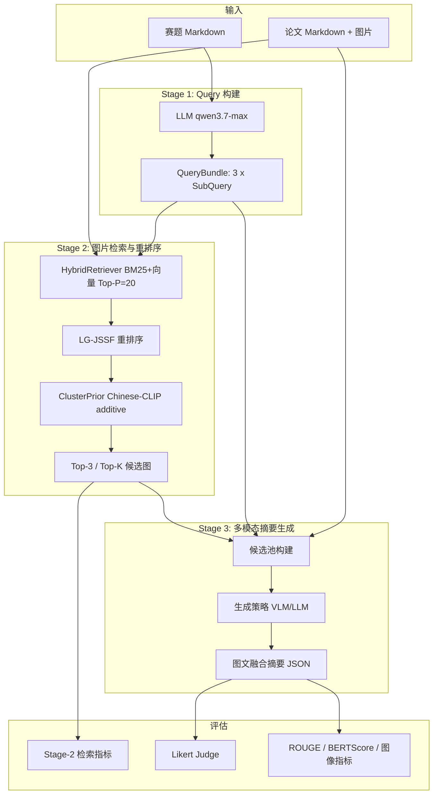
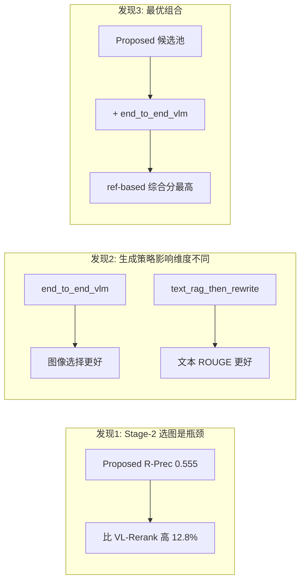

# M3-Sum 项目交接文档

> **Multimodal Mathematical Modeling Summary** — 布局感知的多模态数学建模论文摘要生成系统  
> 文档版本：2026-07-24  
> 主实验批次：`trial_31`（31 篇标注论文）

---

## 目录

1. [当前情况概述](#0-当前情况概述)
2. [项目概述](#1-项目概述)
3. [系统架构](#2-系统架构)
4. [各阶段方法详解](#3-各阶段方法详解)
5. [评估体系](#4-评估体系)
6. [数据集与标注](#5-数据集与标注)
7. [关键实验结果](#6-关键实验结果)
8. [代码工程说明](#7-代码工程说明)
9. [未完成工作与后续方向](#8-未完成工作与后续方向)

---

## 0. 当前情况概述

当前的主要贡献是提出了一个基于先验启发式规则的图片重排方法，这个方法在Top-6图片重排的各项指标上相比其它重排方法有明显优势；
然而，在第三阶段生成摘要部分，本计划用作基线的端到端VLM生成的多模态摘要在综合分与召回率等指标上反而优于Proposed方法的两阶段先检索再生成管线，因此当前实验数据难以论证设计的启发式方法能够在生成多模态摘要这个任务上带来明确提升。

可以考虑的调整思路（从易到难）：

0.(不动Ground Truth，试做优化) 尝试更大规模标注以及进一步优化启发式方法权重等，当前第三阶段结果不算很离谱，在图像准确率和文本指标上对比VLLM有微弱优势，但是召回率上差一截，设法进一步搜索启发式权重配置等，再稍作提升，也能有东西讲。

1.(尝试反用二阶段工具，做无关图片排除) 既然端到端直接拿一篇文章的所有图片生成比预召回的好，考虑能不能反向使用启发式重排方法，把最低分的 n% 候选图片排除掉，看能否带来基于端到端基线的进一步提升。

2.(调整Ground Truth的分布) 调整GroundTruth摘要构造方法，不再直接往获奖人类摘要里插图，而是用旗舰VLLM基于人类优秀摘要做Few-shot生成，结合人类专家校验审核，构造合理、但分布更符合指标bias的Ground_Truth。

3.(改任务目标) 修改任务目标，不以摘要为最终产物（因为本来就没有天然的最佳数模多模态摘要，需要人造GroundTruth，那motivation肯定是辅助评阅，既然如此，还不如直接更进一步，结合AIGC或者Single/Multi Agent模块生成思维导图），而是生成单论文思维导图，或者结合GraphEval的DAG。或者从**垂域多模态信息检索(IR)的角度来立论，而不是多模态摘要**。

4.(全部推倒重来) 指令微调/强化学习/GAN，考虑使用SFT/DPO/GRPO/GAN等。设计可验证/合理/与人类监督预对齐过的数据合成管线，训练端到端的图文摘要生成模型。

## 1. 项目概述


### 1.1 项目目标

M3-Sum 面向**数学建模竞赛论文**（含正文 Markdown + 图片），自动生成一份**图文融合的多模态摘要**。设计目标是帮助评阅专家在约 **1 分钟**内把握论文的核心方法、模型架构与关键结果，而不必通读全文。

### 1.2 核心问题

传统文本摘要无法传达方法框架图、流程图、关键结果图等视觉信息。本项目将任务分解为：

1. **理解信息需求**：从赛题文本生成面向「分析 / 建模 / 求解」的子查询；
2. **选出关键图片**：在论文全部图片中检索并重排序，挑出最适合进入摘要的候选图；
3. **生成图文融合摘要**：基于候选图与正文上下文，由 VLM/LLM 生成含 `[Insert Figure Cn]` 占位符的多模态摘要。


### 1.3 技术路线

- **LLM / VLM / Embedding**：阿里云 DashScope（OpenAI 兼容接口），默认模型 `qwen3.7-max`（管线）、`qwen3.6-27b`（Stage-3 生成与 Likert Judge）、`text-embedding-v4`（向量检索）
- **本地模型**：Chinese-CLIP（`OFA-Sys/chinese-clip-vit-base-patch16`）用于 ClusterPrior 与 Zero-shot CLIP baseline
- **流水线架构**：三阶段级联 + 独立评估模块 + PyQt6 标注/Case Study 工具


### 1.4 主要贡献点（方法层面）


| 阶段      | 核心方法                                 | 要点                                                       |
| ------- | ------------------------------------ | -------------------------------------------------------- |
| Stage 1 | Query 构建                             | LLM 将赛题分解为 3 路语义聚焦子查询                                    |
| Stage 2 | **LG-JSSF + ClusterPrior**（Proposed） | 直接相似度 + 共现链接 + 布局/类型先验 + CLIP 聚类弱先验                      |
| Stage 2 | Proposed-v2                          | Summary Proposal 五维可解释特征，用于候选池增强对比                       |
| Stage 3 | 双策略生成                                | `text_rag_then_rewrite`（两阶段）vs `end_to_end_vlm`（端到端 VLM） |
| 评估      | Likert Judge                         | VLM 三维度主观评分（CR / ICN / OCDU）                             |


---


## 2. 系统架构


### 2.1 三阶段流水线




### 2.2 数据流与产物路径

以 `trial_31` 为例（配置见 `[src/configs/trial_31.yaml](../src/configs/trial_31.yaml)`）：


| 阶段      | 输入                              | 输出目录                                  | 产物格式                                                    |
| ------- | ------------------------------- | ------------------------------------- | ------------------------------------------------------- |
| Stage 1 | 赛题文本                            | `outputs/trial_31/stage1/`            | `{paper_id}.json`（QueryBundle）                          |
| Stage 2 | QueryBundle + 论文 blocks/figures | `outputs/trial_31/stage2/`            | `{paper_id}.json`（`all_scores` + `top3_figures`）        |
| Stage 3 | 候选池 + 正文上下文                     | `outputs/trial_31/stage3_generation/` | `{Method}__top{K}__{Strategy}__{Model}/{paper_id}.json` |
| 评估      | 上述产物 + GT                       | `outputs/trial_31/eval/`              | CSV / HTML / PNG 报告                                     |


### 2.3 核心模块依赖

```
src/m3sum/
├── pipeline/runner.py          # PipelineRunner：三阶段总调度
├── stage1_query/               # Query 构建
├── stage2_rerank/              # 检索、LG-JSSF、ClusterPrior、Baselines
├── stage3_generation/          # 候选池、生成策略、实验运行器
├── eval/                       # 各阶段评估与可视化
├── data/                       # schema、语料适配、GT 加载
└── clients/                    # DashScope API 客户端

src/abstract_eval/            # Likert Judge 与评分量表
src/fusion_method/              # 多方法排序融合（Borda / RRF 等）
data_annotation/                # PyQt6 人工标注工具
case_study/                     # PyQt6 Case Study 可视化 UI
```


### 2.4 缓存机制

- **Embedding 缓存**：`outputs/trial_31/cache/embeddings/`
- **Stage-2 评估缓存**：`outputs/trial_31/cache/stage2_eval/`（text / clip / vl_rerank）
- **Stage-3 评估缓存**：`outputs/trial_31/cache/stage3_eval/`（Likert Judge 结果按 hash 缓存）
- 所有阶段支持 `from_cache` / `use_cache`，避免重复 API 调用

---


## 3. 各阶段方法详解


### 3.1 Stage 1：Query 构建

**实现文件**：`[src/m3sum/stage1_query/query_builder.py](../src/m3sum/stage1_query/query_builder.py)`  
**Prompt**：`[src/m3sum/stage1_query/prompts/query_construction.txt](../src/m3sum/stage1_query/prompts/query_construction.txt)`

#### 算法

1. 输入赛题全文 `problem_text`（来自 `usable_data/problem_mds/`）
2. 调用 LLM，要求严格输出 JSON，包含 **3 个子查询**，维度固定为：
  - **分析**：问题背景与关键约束
  - **建模**：数学模型与核心假设
  - **求解**：算法与结果验证
3. 每个 SubQuery 含 `dimension`、`query`（≥15 字）、`keywords`（3–6 个）
4. 校验 `len(sub_queries) == 3`，否则抛错


#### 数据结构

```python
@dataclass
class SubQuery:
    dimension: str
    query: str
    keywords: list[str]
    embedding: list[float] | None = None

@dataclass
class QueryBundle:
    paper_id: str
    problem_text: str
    sub_queries: list[SubQuery]
```


#### 关键配置

- `retrieval.query_use_keywords: false`（trial_31 默认）：Stage-2 检索时**不**拼接 keywords，仅用 `query` 文本

---


### 3.2 Stage 2：图片检索与重排序

Stage 2 是本项目**方法贡献最集中的阶段**，包含混合检索、LG-JSSF 多信号融合、ClusterPrior 增强，以及 9 种 baseline 对比。

#### 3.2.1 混合检索（HybridRetriever）

**实现**：`[src/m3sum/stage2_rerank/hybrid_retriever.py](../src/m3sum/stage2_rerank/hybrid_retriever.py)`

- 对论文文本块（blocks）建立 **BM25 + 向量**混合索引
- 默认权重：`bm25_weight=0.4`，`vector_weight=0.6`
- 每个 SubQuery 检索 Top-P=**20** 个相关文本块，作为后续 link 特征的 evidence 来源
- Query 向量由 `text-embedding-v4` 生成，支持缓存


#### 3.2.2 LG-JSSF 核心打分（Legacy → Proposed 基础）

**实现**：`[src/m3sum/stage2_rerank/rerank_legacy.py](../src/m3sum/stage2_rerank/rerank_legacy.py)`、`[fusion.py](../src/m3sum/stage2_rerank/fusion.py)`

对每张候选图片，计算多维特征后融合：

**分数融合公式**（`[compute_fused_score](../src/m3sum/stage2_rerank/fusion.py)`）：

```
base = α · S_direct + (1-α) · S_link     # α=0.5
base *= P_layout                          # 布局先验（论文位置）
base *= P_type                            # 类型先验（方法图 boost / 数据图 penalty）
# ClusterPrior（Proposed 额外步骤）：
base += β · cluster_prior                 # additive, β=0.25
```

**各分量说明**：


| 符号              | 含义                | 实现要点                                                                             |
| --------------- | ----------------- | -------------------------------------------------------------------------------- |
| `S_direct`      | Query 与图片的直接余弦相似度 | 对 3 路 SubQuery embedding 与 figure embedding 取 max/mean                           |
| `S_link`        | 共现链接分数            | 通过 HybridRetriever 找 evidence blocks，计算 figure-block 共现                          |
| `P_layout`      | 布局先验              | 图片在正文中的位置权重（`[layout_weights.py](../src/m3sum/stage2_rerank/layout_weights.py)`） |
| `P_type`        | 类型先验              | 方法图 1.15x boost，数据图 0.92x penalty（可配置）                                           |
| `cluster_prior` | CLIP 聚类弱先验        | 见下节                                                                              |


**改造前后对比（Legacy vs New）**：

- Legacy：无条件 local 窗口、`S_link` 全局 max、固定 `P_type` 1.5/0.8
- New（Proposed）：分源门控、自匹配跳过、可配置 `rerank_experimental` 参数


#### 3.2.3 ClusterPrior 增强

**实现**：`[src/m3sum/stage2_rerank/cluster_prior.py](../src/m3sum/stage2_rerank/cluster_prior.py)`、`[main_method.py](../src/m3sum/stage2_rerank/main_method.py)`

- 使用 **Chinese-CLIP** 计算图片 embedding
- 与预定义领域聚类质心（`[cluster_prior.json](../src/m3sum/cluster_prior.json)`）做余弦相似度
- **门控策略** `top1_margin`：top1 相似度 ≥ `tau=0.72` 时通过，prior 乘以 margin 稀释因子
- **融合方式**：additive（`score = base + β · prior`，β=0.25），网格搜索后选定
- Proposed 管线在 `rerank_figures_legacy` 之后调用 `finalize_stage2_with_cluster` 做后处理


#### 3.2.4 Summary Proposal（Proposed-v2）

**实现**：`[src/m3sum/stage2_rerank/summary_proposal.py](../src/m3sum/stage2_rerank/summary_proposal.py)`

Proposed-v2 **不替换** Proposed，而是提供可解释的五维特征评估，用于候选池增强对比：


| 维度组        | 默认权重 | 组成                                    |
| ---------- | ---- | ------------------------------------- |
| layout     | 0.30 | legacy 的 `p_layout`                   |
| relevance  | 0.35 | legacy_score + direct/link 系列特征加权     |
| type       | 0.12 | type + cluster                        |
| generality | 0.13 | explicit/evidence/local/early_body 计数 |
| cluster    | 0.10 | 归一化 cluster prior                     |


最终分数：`legacy_blend=0.55` 的 legacy 分数 + `0.45` 的 proposal 分数。

#### 3.2.5 Stage-2 Baseline 方法（9 种）

配置于 `trial_31.yaml` [→](../src/configs/trial_31.yaml) `stage2_eval.methods`：


| 方法                          | 说明                                       | 实现位置                           |
| --------------------------- | ---------------------------------------- | ------------------------------ |
| **Proposed**                | LG-JSSF + ClusterPrior additive          | `main_method.py`               |
| **Proposed-v2**             | Summary Proposal 特征排序                    | `baselines/proposed_v2.py`     |
| Qwen3-VL-Rerank-ImgCap+Link | DashScope VL Rerank，图+caption+link chunk | `baselines/qwen3_vl_rerank.py` |
| Qwen3-VL-Rerank-ImgCap      | VL Rerank，图+caption（强基线）                 | 同上                             |
| Qwen3-VL-Rerank-Img         | VL Rerank，仅图片（弱基线）                       | 同上                             |
| Layout-Order                | 按论文中出现顺序                                 | `baselines/layout_order.py`    |
| Caption-BM25                | 图注 BM25 检索                               | `baselines/caption_bm25.py`    |
| Caption-Dense-v4            | 图注 dense 向量检索                            | `baselines/caption_dense.py`   |
| Zero-shot-CLIP              | Chinese-CLIP 零样本匹配                       | `baselines/zeroshot_clip.py`   |


#### 3.2.6 多方法排序融合（fusion_method）

**目录**：`[src/fusion_method/](../src/fusion_method/)`

Stage-2 各方法产出独立排序后，可通过以下策略融合候选池：

- Borda Count
- Reciprocal Rank Fusion (RRF)
- Weighted Score
- Cascade
- Union Pool RRF

Dynamic-Union-PQL（Stage-3 候选池）即使用 RRF 融合 Proposed、Qwen3-VL-Rerank-ImgCap+Link、Layout-Order 的 Top-6。

---


### 3.3 Stage 3：多模态摘要生成

**实现**：`[src/m3sum/stage3_generation/](../src/m3sum/stage3_generation/)`

#### 3.3.1 候选池构建

**实现**：`[candidate_pool.py](../src/m3sum/stage3_generation/candidate_pool.py)`

从 Stage-2 各方法的排序结果截取 Top-K 作为 VLM 的候选图片池。池类型：


| 池类型               | 来源                 | trial_31 配置                              |
| ----------------- | ------------------ | ---------------------------------------- |
| 普通 ranker 池       | 某 Stage-2 方法 Top-K | Layout-Order、Qwen3-VL-Rerank-ImgCap 等    |
| All-Figures       | 论文全部图片             | 按论文实际图片数动态 K                             |
| Dynamic-Union-PQL | RRF 融合多方法          | Proposed + VL-Rerank+Link + Layout-Order |
| Reference-Oracle  | 人工 GT 序列           | 上界参考                                     |


#### 3.3.2 生成策略

**实现**：`[generators.py](../src/m3sum/stage3_generation/generators.py)`


| 策略                      | 流程                                          | 特点              |
| ----------------------- | ------------------------------------------- | --------------- |
| `text_rag_then_rewrite` | ① LLM 生成纯文本 RAG 摘要 → ② VLM 基于文本+候选图重写为图文融合版 | 文本质量（ROUGE）通常更高 |
| `end_to_end_vlm`        | VLM 一次性输入正文上下文 + 候选图，直接生成图文融合摘要             | 图像选择质量通常更好      |
| `reference_oracle`      | 直接使用 GT 的 `multimodal_sequence`             | 评估上界            |


**输出 JSON 结构**（规范化后）：

- `generated_summary`：含 `[Insert Figure C1]` 占位符的全文
- `inserted_figures` / `selected_image_hashes`：选中图片 hash 列表
- `placeholders`：占位符列表
- `rationale`：选图理由

**Prompt 约束**（System Prompt）：

- 优先方法图、流程图、架构图、关键结果图
- 避免装饰性图片
- 占位符格式严格为 `[Insert Figure Cn]`
- `response_format=json_object`，`temperature=0.2`


#### 3.3.3 实验矩阵

**运行器**：`[experiment_runner.py](../src/m3sum/stage3_generation/experiment_runner.py)`  
**入口脚本**：`[src/scripts/run_stage3_generation_experiments.py](../src/scripts/run_stage3_generation_experiments.py)`

交叉组合：**Stage-2 方法 × 池大小 K × 生成策略 × VLM 模型**

trial_31 主配置（`pool_sizes: [6]`）：

```yaml
stage3_generation:
  rerank_methods:
    - Qwen3-VL-Rerank-ImgCap
    - Layout-Order
    - All-Figures
    - Dynamic-Union-PQL
  strategies: [text_rag_then_rewrite, end_to_end_vlm]
  models: [qwen3.6-27b]
```

> **注意**：Proposed 的 Stage-3 实验（`Proposed__top6__`*）已在 `outputs/trial_31/stage3_generation/` 中生成，并纳入 ref-based 评估，但**未**列入 trial_31 默认 Likert Judge 评测配置中的 `rerank_methods`。


#### 3.3.4 文本上下文构建

- `max_body_chars: 120000`
- `max_retrieved_chars: 18000`
- `text_context_top_p: 8`（HybridRetriever 检索 evidence 块数）
- 图片以 base64 data URI 嵌入 VLM multimodal message

---


## 4. 评估体系


### 4.1 Stage-2 检索/排序指标

**实现**：`[src/m3sum/eval/stage2_rerank_metrics.py](../src/m3sum/eval/stage2_rerank_metrics.py)`


| 指标              | 含义                     | 说明               |
| --------------- | ---------------------- | ---------------- |
| **R-Precision** | Top-R 与 GT 交集 / R（R=   | GT               |
| **IP@3**        |                        | rec ∩ GT         |
| **IR@3**        |                        | rec ∩ GT         |
| **IR@4~8**      | 扩展 Recall              | 衡量更大 K 下的 GT 覆盖率 |
| **Jaccard@3**   |                        | rec ∩ GT         |
| **MaxSim@3**    | CLIP 语义最大相似度           | 需 Chinese-CLIP   |
| **MAP**         | Mean Average Precision | 排序质量             |
| **MRR**         | Mean Reciprocal Rank   | 首个命中位置           |


**混合检索池覆盖**（Legacy 对比，`summary.csv`）：

- Hit@1：24/31（77.4%）
- Hit@3：27/31（87.1%）
- 3 篇完全未命中：`2023_G_E032`、`2023_G_E176`、`2018_G_A229`
- 1 篇 GT 不在检索池：`2023_G_C228`（`gt_in_pool=0`）


### 4.2 Stage-3 Likert Judge（主观评估）

**实现**：`[src/abstract_eval/likert_judge.py](../src/abstract_eval/likert_judge.py)`  
**量表**：`[src/abstract_eval/Likert_scale.md](../src/abstract_eval/Likert_scale.md)`

使用 VLM（`qwen3.6-27b`，temperature=0.0）对生成摘要进行 **1–5 分** Likert 评分：


| 维度          | 缩写          | 评估核心              |
| ----------- | ----------- | ----------------- |
| 认知易读性与低认知负荷 | **CR**      | 图片是否直观，读者能否一眼看懂   |
| 信息互补性与插入必要性 | **ICN**     | 图文是否 1+1>2，插入是否必要 |
| 整体一致性与决策实用性 | **OCDU**    | 作为「1 分钟速览工具」是否有效  |
| 综合分         | **Overall** | 三维度均值             |


Judge 输入：摘要文本 + 占位符 + 选中图片（base64）+ 候选图元数据。  
结果缓存于 `outputs/trial_31/cache/stage3_eval/`。

### 4.3 Stage-3 基于参考的自动评估

**实现**：`[src/m3sum/eval/stage3_ref_based_eval.py](../src/m3sum/eval/stage3_ref_based_eval.py)`


| 类别    | 指标                                                    |
| ----- | ----------------------------------------------------- |
| 图像选择  | Precision / Recall / F1、Ordering Score、Position Score |
| 文本相似度 | ROUGE-1 / ROUGE-2 / ROUGE-L                           |
| 语义相似度 | BERTScore F1                                          |
| 综合    | `comprehensive_score`（上述加权汇总）                         |


Reference-Oracle 在所有指标上为理论上界（=1.0）。

### 4.4 评估产物

所有报告位于 `[outputs/trial_31/eval/](../outputs/trial_31/eval/)`：


| 文件                               | 内容                           |
| -------------------------------- | ---------------------------- |
| `stage2_reranking_summary.csv`   | 9 方法 × 均值指标                  |
| `stage2_reranking_win_rates.csv` | Proposed vs 各 baseline 逐论文胜率 |
| `stage2_ablation_results.csv`    | 消融实验逐论文结果                    |
| `stage2_reranking_report.html`   | Stage-2 完整 HTML 报告           |
| `stage3_generation_summary.csv`  | Likert Judge 汇总              |
| `stage3_ref_based_summary.csv`   | 自动指标汇总                       |
| `*.png`                          | 柱状图、热力图、趋势图等                 |


---


## 5. 数据集与标注


### 5.1 数据批次演进


| 批次           | 样本量      | 说明                       |
| ------------ | -------- | ------------------------ |
| trial_10     | 10 篇     | 初始实验                     |
| trial_20     | 20 篇     | 扩展 + Case Study 验证       |
| **trial_31** | **31 篇** | 当前主批次（trial_20 + 11 篇新增） |


### 5.2 原始数据


| 目录                                         | 内容                |
| ------------------------------------------ | ----------------- |
| `usable_data/cleaned_excellent_paper_mds/` | 清洗后的优秀论文 Markdown |
| `usable_data/cleaned_graduate_paper_mds/`  | 研究生论文             |
| `usable_data/cleaned_other_paper_mds/`     | 其他比赛论文            |
| `usable_data/problem_mds/`                 | 赛题 Markdown       |


论文 Markdown 中图片以 hash 占位符引用（如 `images/{hash}.jpg`）。

### 5.3 Ground Truth 格式

**目录**：`[data/trial_31/ground_truth/](../data/trial_31/ground_truth/)`  
**来源**：PyQt6 标注工具 → `data_annotation/annotations/*.json` → 脚本转换

```json
{
  "retrieval_gt": {
    "relevant_figure_hashes": ["hash1", "hash2"]
  },
  "insertion_gt": {
    "selected_hashes": ["hash1", "hash2"],
    "reference_text": "...",
    "multimodal_sequence": [
      {"type": "text", "content": "..."},
      {"type": "image", "image_hash": "...", "caption": "..."}
    ]
  }
}
```

- `retrieval_gt`：与摘要相关的全部图片（当前暂等于 insertions，可扩展为 2–8 张）
- `insertion_gt`：最终插入摘要的图片序列 + 参考文本 + 完整多模态序列
- trial_31 配置 `gt_mode: insertions_only`


### 5.4 标注工具

**目录**：`[data_annotation/](../data_annotation/)`

```bash
cd data_annotation
pip install -r requirements.txt
python main.py
```

功能：加载论文图片池，人工标注多模态摘要的 GT 插入序列，导出 JSON 标注文件。

### 5.5 Manifest 准备

```bash
cd src
python scripts/prepare_trial_manifest.py configs/trial_31.yaml
```

生成 `data/trial_31/manifest.json` 与 GT 文件，并初始化 `acceptance_review.csv`。

---


## 6. 关键实验结果

> 以下数据均来自 `outputs/trial_31/eval/`，31 篇论文均值。


### 6.1 Stage-2 方法对比（主结果）


| 排名  | 方法                          | R-Precision | IP@3      | IR@3      | MAP       | MRR       | Jaccard@3 |
| --- | --------------------------- | ----------- | --------- | --------- | --------- | --------- | --------- |
| 1   | **Proposed**                | **0.555**   | 0.473     | **0.520** | **0.646** | 0.845     | **0.345** |
| 2   | Proposed-v2                 | 0.504       | **0.484** | **0.532** | 0.639     | **0.867** | **0.349** |
| 3   | Qwen3-VL-Rerank-ImgCap+Link | 0.492       | 0.419     | 0.477     | 0.578     | 0.714     | 0.294     |
| 4   | Layout-Order                | 0.465       | 0.398     | 0.432     | 0.582     | 0.879     | 0.272     |
| 5   | Qwen3-VL-Rerank-Img         | 0.449       | 0.430     | 0.502     | 0.555     | 0.658     | 0.313     |
| 6   | Qwen3-VL-Rerank-ImgCap      | 0.374       | 0.366     | 0.401     | 0.500     | 0.641     | 0.238     |
| 7   | Caption-BM25                | 0.294       | 0.247     | 0.294     | 0.418     | 0.557     | 0.180     |
| 8   | Zero-shot-CLIP              | 0.260       | 0.247     | 0.267     | 0.388     | 0.442     | 0.179     |
| 9   | Caption-Dense-v4            | 0.247       | 0.204     | 0.215     | 0.343     | 0.400     | 0.133     |


**结论**：

1. **Proposed 在 R-Precision、IR@3、MAP 等核心指标上全面领先**，R-Precision 比最强 neural baseline（Qwen3-VL-Rerank-ImgCap+Link）高约 **12.8%**
2. **Proposed-v2** 在 MRR（0.867）、IR@3（0.532）、Jaccard@3（0.349）上略优于 Proposed，但 R-Precision 和 MAP 略低；两者高度接近（R-Precision 胜率仅 12.9%，27/31 平局）
3. 传统文本检索（Caption-BM25/Dense）和 Zero-shot CLIP 表现最差
4. Layout-Order 的 MRR 最高（0.879），说明按顺序排列对「首个命中」有利，但 R-Precision 明显低于 Proposed


### 6.2 Stage-2 消融实验

递增式消融（Add 模式，31 篇均值）：


| 变体                                | R-Precision | 相对 DirectOnly 提升 |
| --------------------------------- | ----------- | ---------------- |
| DirectOnly                        | 0.250       | —                |
| Direct+Link                       | 0.248       | +0%（link 单独效果有限） |
| Direct+Link+Layout                | 0.463       | +85%             |
| Direct+Link+Layout+Type (LG-JSSF) | 0.513       | +105%            |
| LG-JSSF+ClusterAdd (Proposed)     | **0.550**   | **+120%**        |


Drop-one 消融（移除单组件）：


| 移除组件             | R-Precision | 下降幅度              |
| ---------------- | ----------- | ----------------- |
| w/o P_layout     | 0.328       | **-43%**（最敏感）     |
| w/o S_link       | 0.464       | -16%              |
| w/o P_type       | 0.475       | -14%              |
| w/o LocalWindow  | 0.457       | -17%              |
| w/o ClusterPrior | 0.513       | -7%（与 LG-JSSF 相同） |


**结论**：

- **P_layout 和 S_link 是最关键组件**，移除 P_layout 导致性能崩溃
- **ClusterPrior additive 贡献约 +7%**（0.513 → 0.550）
- Add 与 Mul 融合模式效果相近（0.550 vs 0.548）


### 6.3 Legacy 方法改进


| 方法                     | R-Precision | IP@3      | IR@3      | MAP       | MRR   |
| ---------------------- | ----------- | --------- | --------- | --------- | ----- |
| LG-JSSF-Legacy         | 0.507       | 0.430     | 0.480     | 0.617     | 0.855 |
| LG-JSSF-New (Proposed) | **0.555**   | **0.473** | **0.520** | **0.646** | 0.845 |


新方法在所有指标上优于 Legacy（MRR 略低 0.01）。

### 6.4 Stage-3 Likert Judge 结果

评测配置：`pool_size=6`，Judge 模型 `qwen3.6-27b`  
覆盖方法：Layout-Order、Qwen3-VL-Rerank-ImgCap、Reference-Oracle（**不含 Proposed**）


| 方法                         | 策略                    | CR       | ICN      | OCDU     | Overall  |
| -------------------------- | --------------------- | -------- | -------- | -------- | -------- |
| Reference-Oracle           | reference_oracle      | 4.29     | 4.61     | 4.29     | 4.30     |
| **Qwen3-VL-Rerank-ImgCap** | **end_to_end_vlm**    | **4.58** | **4.77** | **4.61** | **4.63** |
| Layout-Order               | end_to_end_vlm        | 4.58     | 4.68     | 4.55     | 4.57     |
| Layout-Order               | text_rag_then_rewrite | 4.48     | 4.45     | 4.35     | 4.37     |
| Qwen3-VL-Rerank-ImgCap     | text_rag_then_rewrite | 4.35     | 4.42     | 4.32     | 4.38     |


**结论**：

1. **end_to_end_vlm 全面优于 text_rag_then_rewrite**（Likert 三维度均更高）
2. Qwen3-VL-Rerank-ImgCap + end_to_end_vlm 获最高 Overall（4.63）
3. Reference-Oracle Overall 仅 4.30，因为 GT 序列本身并非所有图都完美——Likert 评估的是「生成质量」而非「与 GT 一致性」


### 6.5 Stage-3 自动评估（ref-based，pool_size=6，n=31）


| 方法                     | 策略                    | 图像 F1     | ROUGE-L | BERTScore | 综合分       |
| ---------------------- | --------------------- | --------- | ------- | --------- | --------- |
| Reference-Oracle       | reference_oracle      | 1.000     | 1.000   | 1.000     | 1.000     |
| **Proposed**           | **end_to_end_vlm**    | **0.454** | 0.391   | **0.774** | **0.440** |
| Proposed               | text_rag_then_rewrite | 0.453     | 0.378   | 0.730     | 0.433     |
| Layout-Order           | end_to_end_vlm        | 0.467     | 0.358   | 0.754     | 0.420     |
| Layout-Order           | text_rag_then_rewrite | 0.426     | 0.385   | 0.729     | 0.417     |
| Qwen3-VL-Rerank-ImgCap | end_to_end_vlm        | 0.378     | 0.363   | 0.754     | 0.391     |
| Qwen3-VL-Rerank-ImgCap | text_rag_then_rewrite | 0.313     | 0.374   | 0.728     | 0.368     |


**结论**：

1. **Proposed + end_to_end_vlm 获最高综合分（0.440）**，图像选择与语义质量均衡最优
2. Layout-Order 图像 Precision 最高（0.634），但排序分和 ROUGE 较低
3. text_rag_then_rewrite 的 ROUGE-L 普遍高于 end_to_end_vlm，但图像选择质量较差——**存在文本质量 vs 图像质量的 trade-off**
4. Dynamic-Union-PQL 在 pool_size=6 时仅 1 篇有效样本，结果不可靠，需排查


### 6.6 跨阶段关键洞察




---


## 7. 代码工程说明


### 7.1 目录结构

```
multimodal_summary_20260620/
├── src/                          # 核心代码
│   ├── m3sum/                    # 主 Python 包
│   ├── scripts/                  # 可执行脚本
│   ├── configs/                  # YAML 配置（trial_10/20/31, smoke）
│   ├── abstract_eval/            # Likert Judge
│   ├── fusion_method/            # 排序融合
│   └── requirements.txt
├── data/                         # 标注数据（trial_10/20/31）
├── data_annotation/              # PyQt6 标注工具
├── case_study/                   # PyQt6 Case Study UI
├── usable_data/                  # 原始/清洗后论文 Markdown
├── outputs/                      # 实验输出（按 trial 隔离）
├── outputs_copy/                 # 输出备份
├── reports/                      # Token 成本估算等报告
├── data_analysis_scripts/        # Bad case 分析脚本
├── automatic_data_cleaning/      # 自动数据清洗
├── timestamps/                   # Git OpenTimestamps 证明
└── docs/                         # 本文档
```


### 7.2 环境配置

```bash
cd src
pip install -r requirements.txt
```

主要依赖：`openai`、`rank-bm25`、`rouge-score`、`bert-score`、`torch`、`transformers`、`dashscope`、`PyYAML`、`pandas`、`matplotlib`

**API 配置**：在 `[src/configs/trial_31.yaml](../src/configs/trial_31.yaml)` 的 `api` 段设置 `base_url` 与 `api_key`（DashScope）。也可通过环境变量覆盖（见 `m3sum.config.resolve_api_credentials`）。

### 7.3 运行指南


#### 一键试跑（推荐）

```bash
cd src
python scripts/run_trial.py configs/trial_31.yaml
```

四步流程：manifest 准备 → 管线运行 → sanity check → 评测报告

#### 分步运行

```bash
# 1. 准备 manifest + GT
python scripts/prepare_trial_manifest.py configs/trial_31.yaml

# 2. 运行管线（可选 stage: "1" / "2" / "3" / "all"）
python scripts/run_pipeline.py configs/trial_31.yaml

# 3. Stage-2 基线评估
python scripts/evaluate_stage2_reranking.py configs/trial_31.yaml

# 4. Stage-3 生成实验
python scripts/run_stage3_generation_experiments.py configs/trial_31.yaml

# 5. Stage-3 Likert 评估
python scripts/evaluate_stage3_generation.py configs/trial_31.yaml

# 6. Stage-3 自动评估
python scripts/evaluate_stage3_ref_based.py configs/trial_31.yaml

# 7. 可视化
python scripts/plot_stage2_reranking.py configs/trial_31.yaml
python scripts/plot_stage3_generation.py configs/trial_31.yaml
```


#### 冒烟测试

```bash
python scripts/run_trial.py configs/smoke.yaml
```

`smoke.yaml`：1 篇样本、`dry_run` 模式，零 API 成本验证链路。

### 7.4 关键脚本索引


| 脚本                                     | 用途              |
| -------------------------------------- | --------------- |
| `run_trial.py`                         | 统一试跑入口          |
| `run_pipeline.py`                      | 底层管线            |
| `run_stage3_generation_experiments.py` | Stage-3 批量实验    |
| `evaluate_stage2_reranking.py`         | Stage-2 评估      |
| `evaluate_stage3_generation.py`        | Likert Judge 评估 |
| `evaluate_stage3_ref_based.py`         | 自动指标评估          |
| `evaluate_fusion_methods.py`           | 融合方法评估          |
| `sanity_check.py`                      | 检验点             |
| `plot_*.py`                            | 结果可视化           |


### 7.5 辅助工具


#### Case Study UI

```bash
cd case_study
pip install -r requirements.txt
python scripts/export_case_study_data.py --config config.yaml
python -m app.main
```

左侧展示 GT 多模态序列，右侧 Tab 切换各方法 Top-K 选图，顶部展示逐方法指标。详见 `[case_study/README.md](../case_study/README.md)`。

#### 数据分析脚本

- `data_analysis_scripts/bad_case_analysis.py`：Bad case 分析
- `data_analysis_scripts/trial31_selected_image_stats.py`：Trial 31 选图统计


### 7.6 Token 成本估算

来源：`[reports/dpja_token_estimate/](../reports/dpja_token_estimate/)`（DPJA 溯源任务，模型 `qwen3.5-27b`）


| 语料        | 样本数 | Prompt Tokens (avg) | Total Tokens (avg) | 论文字符数 (avg)  |
| --------- | --- | ------------------- | ------------------ | ------------ |
| 研赛（长论文）   | 2   | 24,503              | 26,029             | ~33,500 body |
| 其它比赛（短论文） | 2   | 13,024              | 13,027             | ~15,400 body |
| **总体**    | 4   | 18,763              | 19,528             | —            |


- 长论文单次推理约 **26K–30K tokens**
- 短论文约 **9K–17K tokens**
- 3/4 样本因输出过短被标记为 truncated（`completion_tokens=3`），需关注 `max_output_tokens` 配置

---


## 8. 未完成工作与后续方向


### 8.1 已知问题与局限


| 问题                | 详情                                                            | 影响                    |
| ----------------- | ------------------------------------------------------------- | --------------------- |
| 检索池未覆盖            | `2023_G_C228` GT 不在 Top-P=20 检索池中                             | 该论文所有方法 R-Precision=0 |
| 3 篇完全未命中          | `2023_G_E032`、`2023_G_E176`、`2018_G_A229`                     | 拉低整体 Recall           |
| Dynamic-Union 不稳定 | pool_size=6 时仅 1 篇有效                                          | ref-based 结果不可信       |
| Likert 覆盖不全       | trial_31 默认 Likert 未含 Proposed                                | 无法直接对比 Proposed 的主观质量 |
| GT 规模小            | 31 篇，retrieval_gt 暂等于 insertions                              | 指标方差较大                |
| API 成本            | Stage-2 VL-Rerank baselines + Stage-3 生成 + Likert 均需大量 API 调用 | 全量重跑成本高               |


### 8.2 建议后续工作

**短期（工程完善）**：

1. 将 **Proposed 纳入 Stage-3 Likert Judge** 默认评测配置，形成 Stage-2 → Stage-3 完整闭环
2. 排查 **Dynamic-Union-PQL** 候选池构建逻辑，修复 pool_size=6 的样本覆盖问题
3. 对 4 篇 bad case 论文做案例分析（已有 Case Study UI 支持）
4. 扩展 `retrieval_gt` 为 2–8 张，与 `insertion_gt` 解耦

**中期（方法改进）**：

1. **Proposed-v2 与 Proposed 融合**：v2 在 MRR/IR@3 上略优，可探索二者融合或统一为单一方法
2. **Stage-3 混合策略**：结合 text_rag 的高 ROUGE 与 end_to_end_vlm 的高图像质量（如先 RAG 再 VLM 选图重写）
3. **ClusterPrior 参数自适应**：当前 τ=0.72、β=0.25 为网格搜索固定值，可按论文类型动态调整
4. **扩大数据集**：从 trial_31 继续扩展，覆盖更多年份/题型

**长期（产品化）**：

1. 集成到评阅系统，提供 1 分钟速览界面
2. 支持非数模论文（学术论文、技术报告）的领域迁移
3. Token 成本优化：缓存策略、模型蒸馏、批量推理


### 8.3 实验复现检查清单

- [ ] 配置 `api.base_url` 与 `api.api_key`（DashScope）
- [ ] 安装 `src/requirements.txt` 全部依赖
- [ ] 首次运行需下载 Chinese-CLIP 模型（~400MB）
- [ ] 确认 `data/trial_31/manifest.json` 与 `ground_truth/` 完整（31 篇）
- [ ] 运行 `run_trial.py configs/trial_31.yaml`（或分步运行）
- [ ] 检查 `outputs/trial_31/eval/stage2_reranking_summary.csv` 中 Proposed R-Precision ≈ 0.555
- [ ] 检查 `outputs/trial_31/eval/stage3_ref_based_summary.csv` 中 Proposed+end_to_end_vlm 综合分 ≈ 0.440
- [ ] 可选：运行 Case Study export + UI 进行定性分析

---


## 附录 A：配置参数速查（trial_31）


| 参数                 | 值                 | 位置                                                     |
| ------------------ | ----------------- | ------------------------------------------------------ |
| LLM 模型             | qwen3.7-max       | `models.llm`                                           |
| Embedding          | text-embedding-v4 | `models.embed`                                         |
| Stage-3 生成/Judge   | qwen3.6-27b       | `stage3_generation.models` / `stage3_eval.judge_model` |
| 混合检索 Top-P         | 20                | `retrieval.top_p`                                      |
| BM25 / Vector 权重   | 0.4 / 0.6         | `retrieval.*_weight`                                   |
| LG-JSSF α          | 0.5               | `rerank.alpha`                                         |
| ClusterPrior τ / β | 0.72 / 0.25       | `cluster_prior.main_*`                                 |
| Stage-3 池大小        | 6                 | `stage3_generation.pool_sizes`                         |
| Likert 维度          | CR / ICN / OCDU   | `abstract_eval/Likert_scale.md`                        |


## 附录 B：相关文档与报告


| 资源                     | 路径                                                                                                              |
| ---------------------- | --------------------------------------------------------------------------------------------------------------- |
| Trial 31 数据说明          | `[data/trial_31/README.md](../data/trial_31/README.md)`                                                         |
| Case Study 使用说明        | `[case_study/README.md](../case_study/README.md)`                                                               |
| Likert 评分量表            | `[src/abstract_eval/Likert_scale.md](../src/abstract_eval/Likert_scale.md)`                                     |
| Stage-2 HTML 报告        | `[outputs/trial_31/eval/stage2_reranking_report.html](../outputs/trial_31/eval/stage2_reranking_report.html)`   |
| Stage-3 Likert HTML 报告 | `[outputs/trial_31/eval/stage3_generation_report.html](../outputs/trial_31/eval/stage3_generation_report.html)` |
| Stage-3 自动评估 HTML 报告   | `[outputs/trial_31/eval/stage3_ref_based_report.html](../outputs/trial_31/eval/stage3_ref_based_report.html)`   |


---

